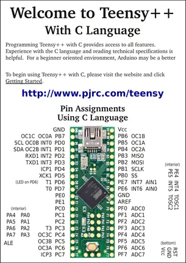
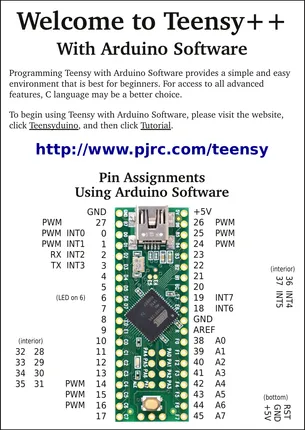

# Teensy++ 2.0

**PJRC** · AVR

Revision: Not identified  
Coverage: Pinout image collected

[Browse all manufacturers](../../../../BROWSE.md) · [Desktop app](https://github.com/valleytechsolutions/black-wire-desktop)

## Pin Assignments, Using C Language

**pinout image** · Reviewed source · PNG

[Open original reference](../../../../library/media/a915c9e847deea749d564edcbb17de1fd9f3e7549c6fbb3391ad2afa197d6a09.png)

**Credit and rights:** Not established; source attribution retained. Source/manufacturer: PJRC.

[Source 1](https://www.pjrc.com/teensy/card4a_rev2_web.pdf) · [Source 2](https://www.pjrc.com/teensy/pinout.html)

 Original PDF page 1 rendered at 220 dpi; no labels changed.

SHA-256: `a915c9e847deea749d564edcbb17de1fd9f3e7549c6fbb3391ad2afa197d6a09`

## Pin Assignments, Using Arduino Software

**pinout image** · Reviewed source · PNG

[Open original reference](../../../../library/media/6cd64576fadd41546edfa5a868c9ef062bc43365570d1666ade96b941c5c784b.png)

**Credit and rights:** Not established; source attribution retained. Source/manufacturer: PJRC.

[Source 1](https://www.pjrc.com/teensy/card4b_rev2_web.pdf) · [Source 2](https://www.pjrc.com/teensy/pinout.html)

 Original PDF page 1 rendered at 220 dpi; no labels changed.

SHA-256: `6cd64576fadd41546edfa5a868c9ef062bc43365570d1666ade96b941c5c784b`

## Pin Assignments, Using C Language

**original reference PDF** · Reviewed source · PDF

[Open original reference](../../../../library/media/26ed96cd53549a6cd88244d55849f09e587b54b4c74469ea3e07917579803b5f.pdf)

**Credit and rights:** Not established; source attribution retained. Source/manufacturer: PJRC.

[Source 1](https://www.pjrc.com/teensy/card4a_rev2_web.pdf) · [Source 2](https://www.pjrc.com/teensy/pinout.html)

SHA-256: `26ed96cd53549a6cd88244d55849f09e587b54b4c74469ea3e07917579803b5f`

## Pin Assignments, Using Arduino Software

**original reference PDF** · Reviewed source · PDF

[Open original reference](../../../../library/media/5d19897603439968a9a75dcfbd2c25febc9ec962f1250c5210da3bda6d995c65.pdf)

**Credit and rights:** Not established; source attribution retained. Source/manufacturer: PJRC.

[Source 1](https://www.pjrc.com/teensy/card4b_rev2_web.pdf) · [Source 2](https://www.pjrc.com/teensy/pinout.html)

SHA-256: `5d19897603439968a9a75dcfbd2c25febc9ec962f1250c5210da3bda6d995c65`

Pin assignments have not been independently electrically verified. Check board revision before wiring.
