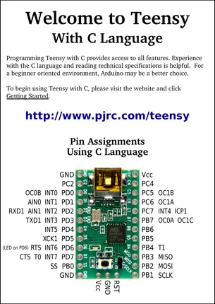
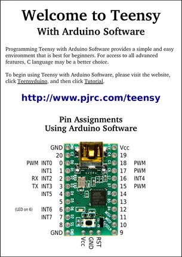

# Teensy 1.0

**PJRC** · AVR

Revision: Not identified  
Coverage: Pinout image collected

[Browse all manufacturers](../../../../BROWSE.md) · [Desktop app](https://github.com/valleytechsolutions/black-wire-desktop)

## Pin Assignments, Using C Language

**pinout image** · Reviewed source · PNG

[Open original reference](../../../../library/media/007c69c09b12931d84a2ef813235f5d300b0dac8bc1fb895e4339692b6c0cd31.png)

**Credit and rights:** Not established; source attribution retained. Source/manufacturer: PJRC.

[Source 1](https://www.pjrc.com/teensy/card1a.pdf) · [Source 2](https://www.pjrc.com/teensy/pinout.html)

 Original PDF page 1 rendered at 220 dpi; no labels changed.

SHA-256: `007c69c09b12931d84a2ef813235f5d300b0dac8bc1fb895e4339692b6c0cd31`

## Pin Assignments, Using Arduino Software

**pinout image** · Reviewed source · PNG

[Open original reference](../../../../library/media/35fca1cff2d29eca5087efc6df46a7d0fa254b323f68c98de789c963cad53ebf.png)

**Credit and rights:** Not established; source attribution retained. Source/manufacturer: PJRC.

[Source 1](https://www.pjrc.com/teensy/card1b.pdf) · [Source 2](https://www.pjrc.com/teensy/pinout.html)

 Original PDF page 1 rendered at 220 dpi; no labels changed.

SHA-256: `35fca1cff2d29eca5087efc6df46a7d0fa254b323f68c98de789c963cad53ebf`

## Pin Assignments, Using C Language

**original reference PDF** · Reviewed source · PDF

[Open original reference](../../../../library/media/2ab8d48eaa4e86842574d41d7ab1c9a840effbfd83045a003e120c15e836bc94.pdf)

**Credit and rights:** Not established; source attribution retained. Source/manufacturer: PJRC.

[Source 1](https://www.pjrc.com/teensy/card1a.pdf) · [Source 2](https://www.pjrc.com/teensy/pinout.html)

SHA-256: `2ab8d48eaa4e86842574d41d7ab1c9a840effbfd83045a003e120c15e836bc94`

## Pin Assignments, Using Arduino Software

**original reference PDF** · Reviewed source · PDF

[Open original reference](../../../../library/media/4b5ad6c6cc37741492d7bd4ac81a6fe1949313abf6fd392b642bbf62adf60fc6.pdf)

**Credit and rights:** Not established; source attribution retained. Source/manufacturer: PJRC.

[Source 1](https://www.pjrc.com/teensy/card1b.pdf) · [Source 2](https://www.pjrc.com/teensy/pinout.html)

SHA-256: `4b5ad6c6cc37741492d7bd4ac81a6fe1949313abf6fd392b642bbf62adf60fc6`

Pin assignments have not been independently electrically verified. Check board revision before wiring.
