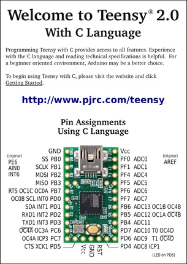
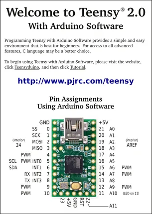

# Teensy 2.0

**PJRC** · AVR

Revision: Not identified  
Coverage: Pinout image collected

[Browse all manufacturers](../../../../BROWSE.md) · [Desktop app](https://github.com/valleytechsolutions/black-wire-desktop)

## Pin Assignments, Using C Language

**pinout image** · Reviewed source · PNG

[Open original reference](../../../../library/media/a249edfbf24e93bfd4e234d47693dcc7f0d549417bb2d2f5e1994b3955264c62.png)

**Credit and rights:** Not established; source attribution retained. Source/manufacturer: PJRC.

[Source 1](https://www.pjrc.com/teensy/card2a_rev5_web.pdf) · [Source 2](https://www.pjrc.com/teensy/pinout.html)

 Original PDF page 1 rendered at 220 dpi; no labels changed.

SHA-256: `a249edfbf24e93bfd4e234d47693dcc7f0d549417bb2d2f5e1994b3955264c62`

## Pin Assignments, Using Arduino Software

**pinout image** · Reviewed source · PNG

[Open original reference](../../../../library/media/6229d1d28f5c882162f428081525089286d498875a6deb149e78f6f2406f17be.png)

**Credit and rights:** Not established; source attribution retained. Source/manufacturer: PJRC.

[Source 1](https://www.pjrc.com/teensy/card2b_rev5_web.pdf) · [Source 2](https://www.pjrc.com/teensy/pinout.html)

 Original PDF page 1 rendered at 220 dpi; no labels changed.

SHA-256: `6229d1d28f5c882162f428081525089286d498875a6deb149e78f6f2406f17be`

## Pin Assignments, Using C Language

**original reference PDF** · Reviewed source · PDF

[Open original reference](../../../../library/media/e000929a5d73cd12212ab7aa6a310ffadfd7bfeb27f9b7d223b85c31f90b263f.pdf)

**Credit and rights:** Not established; source attribution retained. Source/manufacturer: PJRC.

[Source 1](https://www.pjrc.com/teensy/card2a_rev5_web.pdf) · [Source 2](https://www.pjrc.com/teensy/pinout.html)

SHA-256: `e000929a5d73cd12212ab7aa6a310ffadfd7bfeb27f9b7d223b85c31f90b263f`

## Pin Assignments, Using Arduino Software

**original reference PDF** · Reviewed source · PDF

[Open original reference](../../../../library/media/d7c5eef2fb4ade74dada25d417a63cfd9ea5f75342616258b02753d016edb56d.pdf)

**Credit and rights:** Not established; source attribution retained. Source/manufacturer: PJRC.

[Source 1](https://www.pjrc.com/teensy/card2b_rev5_web.pdf) · [Source 2](https://www.pjrc.com/teensy/pinout.html)

SHA-256: `d7c5eef2fb4ade74dada25d417a63cfd9ea5f75342616258b02753d016edb56d`

Pin assignments have not been independently electrically verified. Check board revision before wiring.
