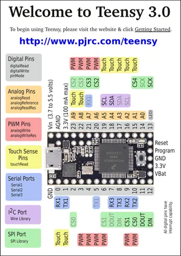
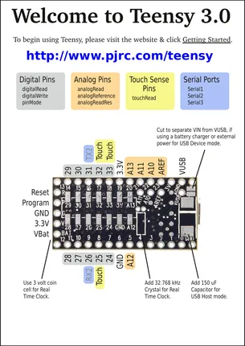

# Teensy 3.0

**PJRC** · NXP ARM

Revision: Not identified  
Coverage: Pinout image collected

[Browse all manufacturers](../../../../BROWSE.md) · [Desktop app](https://github.com/valleytechsolutions/black-wire-desktop)

## Pin Assignments, Front Side

**pinout image** · Reviewed source · PNG

[Open original reference](../../../../library/media/be9e750c8ca76f34296f074cb894310a6a3dea20c7a20a17b6bf68b8ab25cac9.png)

**Credit and rights:** Not established; source attribution retained. Source/manufacturer: PJRC.

[Source 1](https://www.pjrc.com/teensy/card5a.pdf) · [Source 2](https://www.pjrc.com/teensy/pinout.html)

 Original PDF page 1 rendered at 220 dpi; no labels changed.

SHA-256: `be9e750c8ca76f34296f074cb894310a6a3dea20c7a20a17b6bf68b8ab25cac9`

## Pin Assignments, Back Side

**pinout image** · Reviewed source · PNG

[Open original reference](../../../../library/media/b29a23c39b171e6d2b397893c6af595c59f1399612761c7766de00d9d03d81de.png)

**Credit and rights:** Not established; source attribution retained. Source/manufacturer: PJRC.

[Source 1](https://www.pjrc.com/teensy/card5b.pdf) · [Source 2](https://www.pjrc.com/teensy/pinout.html)

 Original PDF page 1 rendered at 220 dpi; no labels changed.

SHA-256: `b29a23c39b171e6d2b397893c6af595c59f1399612761c7766de00d9d03d81de`

## Pin Assignments, Front Side

**original reference PDF** · Reviewed source · PDF

[Open original reference](../../../../library/media/215d8d362a0417ed39197b9d90c48b523ecc084dcc05dd7c1d28f2cde2bd5c91.pdf)

**Credit and rights:** Not established; source attribution retained. Source/manufacturer: PJRC.

[Source 1](https://www.pjrc.com/teensy/card5a.pdf) · [Source 2](https://www.pjrc.com/teensy/pinout.html)

SHA-256: `215d8d362a0417ed39197b9d90c48b523ecc084dcc05dd7c1d28f2cde2bd5c91`

## Pin Assignments, Back Side

**original reference PDF** · Reviewed source · PDF

[Open original reference](../../../../library/media/27dd59fb764565c0319358daabb250785afca6cbb5cefb16588728f2bd671bb1.pdf)

**Credit and rights:** Not established; source attribution retained. Source/manufacturer: PJRC.

[Source 1](https://www.pjrc.com/teensy/card5b.pdf) · [Source 2](https://www.pjrc.com/teensy/pinout.html)

SHA-256: `27dd59fb764565c0319358daabb250785afca6cbb5cefb16588728f2bd671bb1`

Pin assignments have not been independently electrically verified. Check board revision before wiring.
