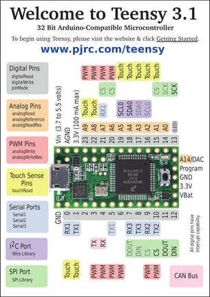
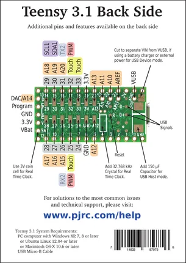

# Teensy 3.1

**PJRC** · NXP ARM

Revision: Not identified  
Coverage: Pinout image collected

[Browse all manufacturers](../../../../BROWSE.md) · [Desktop app](https://github.com/valleytechsolutions/black-wire-desktop)

## Pin Assignments, Front Side

**pinout image** · Reviewed source · PNG

[Open original reference](../../../../library/media/053547ed604406d422f1d17b867dd62e0501bf83833a0571b278eb0c3ffe83bd.png)

**Credit and rights:** Not established; source attribution retained. Source/manufacturer: PJRC.

[Source 1](https://www.pjrc.com/teensy/card5a_rev7.pdf) · [Source 2](https://www.pjrc.com/teensy/pinout.html)

 Original PDF page 1 rendered at 220 dpi; no labels changed.

SHA-256: `053547ed604406d422f1d17b867dd62e0501bf83833a0571b278eb0c3ffe83bd`

## Pin Assignments, Back Side

**pinout image** · Reviewed source · PNG

[Open original reference](../../../../library/media/fd8d299851275d1c2bb58d0a01d7337c53f57d6ff9f731fab42542d5da21ea4d.png)

**Credit and rights:** Not established; source attribution retained. Source/manufacturer: PJRC.

[Source 1](https://www.pjrc.com/teensy/card5b_rev6.pdf) · [Source 2](https://www.pjrc.com/teensy/pinout.html)

 Original PDF page 1 rendered at 220 dpi; no labels changed.

SHA-256: `fd8d299851275d1c2bb58d0a01d7337c53f57d6ff9f731fab42542d5da21ea4d`

## Pin Assignments, Front Side

**original reference PDF** · Reviewed source · PDF

[Open original reference](../../../../library/media/b7d174c1e6ae762adabea6bb14ff81a3a19504c6b6a6fb563cc59b6435bd1b95.pdf)

**Credit and rights:** Not established; source attribution retained. Source/manufacturer: PJRC.

[Source 1](https://www.pjrc.com/teensy/card5a_rev7.pdf) · [Source 2](https://www.pjrc.com/teensy/pinout.html)

SHA-256: `b7d174c1e6ae762adabea6bb14ff81a3a19504c6b6a6fb563cc59b6435bd1b95`

## Pin Assignments, Back Side

**original reference PDF** · Reviewed source · PDF

[Open original reference](../../../../library/media/d9411fdcce5074356f1a48d4ec2d1c84e530f742f07bef9b439919d0b70588ed.pdf)

**Credit and rights:** Not established; source attribution retained. Source/manufacturer: PJRC.

[Source 1](https://www.pjrc.com/teensy/card5b_rev6.pdf) · [Source 2](https://www.pjrc.com/teensy/pinout.html)

SHA-256: `d9411fdcce5074356f1a48d4ec2d1c84e530f742f07bef9b439919d0b70588ed`

Pin assignments have not been independently electrically verified. Check board revision before wiring.
