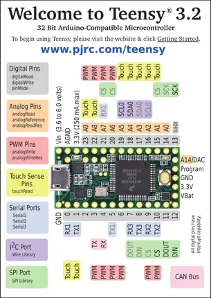
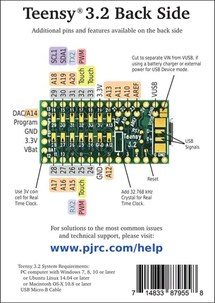

# Teensy 3.2

**PJRC** · NXP ARM

Revision: Not identified  
Coverage: Pinout image collected

[Browse all manufacturers](../../../../BROWSE.md) · [Desktop app](https://github.com/valleytechsolutions/black-wire-desktop)

## Pin Assignments, Front Side

**pinout image** · Reviewed source · PNG

[Open original reference](../../../../library/media/8e0f04945e94081bebfe3e7ef1695bfaca78d8ffe097e5351bb6dc58dea60df3.png)

**Credit and rights:** Not established; source attribution retained. Source/manufacturer: PJRC.

[Source 1](https://www.pjrc.com/teensy/card7a_rev3_web.pdf) · [Source 2](https://www.pjrc.com/teensy/pinout.html)

 Original PDF page 1 rendered at 220 dpi; no labels changed.

SHA-256: `8e0f04945e94081bebfe3e7ef1695bfaca78d8ffe097e5351bb6dc58dea60df3`

## Pin Assignments, Back Side

**pinout image** · Reviewed source · PNG

[Open original reference](../../../../library/media/faf86dbdcad68cee2f0bc3172588ac82becb402f9c501dc55701a83e357584b5.png)

**Credit and rights:** Not established; source attribution retained. Source/manufacturer: PJRC.

[Source 1](https://www.pjrc.com/teensy/card7b_rev3_web.pdf) · [Source 2](https://www.pjrc.com/teensy/pinout.html)

 Original PDF page 1 rendered at 220 dpi; no labels changed.

SHA-256: `faf86dbdcad68cee2f0bc3172588ac82becb402f9c501dc55701a83e357584b5`

## Pin Assignments, Front Side

**original reference PDF** · Reviewed source · PDF

[Open original reference](../../../../library/media/09f2ab9b1be567e9bc871e3d946ce1942d6a89fb5c6d646b234fddd663cfd0e7.pdf)

**Credit and rights:** Not established; source attribution retained. Source/manufacturer: PJRC.

[Source 1](https://www.pjrc.com/teensy/card7a_rev3_web.pdf) · [Source 2](https://www.pjrc.com/teensy/pinout.html)

SHA-256: `09f2ab9b1be567e9bc871e3d946ce1942d6a89fb5c6d646b234fddd663cfd0e7`

## Pin Assignments, Back Side

**original reference PDF** · Reviewed source · PDF

[Open original reference](../../../../library/media/72ea96f3de7cd797863201c77e7e1af01390819057b75a780a9f723d47cbee4c.pdf)

**Credit and rights:** Not established; source attribution retained. Source/manufacturer: PJRC.

[Source 1](https://www.pjrc.com/teensy/card7b_rev3_web.pdf) · [Source 2](https://www.pjrc.com/teensy/pinout.html)

SHA-256: `72ea96f3de7cd797863201c77e7e1af01390819057b75a780a9f723d47cbee4c`

Pin assignments have not been independently electrically verified. Check board revision before wiring.
