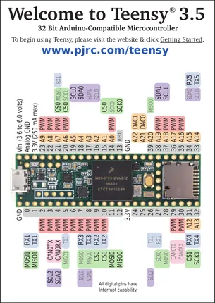
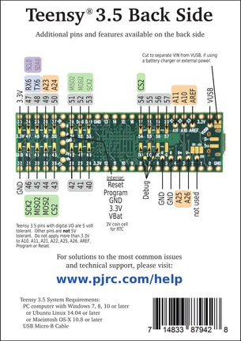

# Teensy 3.5

**PJRC** · NXP ARM

Revision: Not identified  
Coverage: Pinout image collected

[Browse all manufacturers](../../../../BROWSE.md) · [Desktop app](https://github.com/valleytechsolutions/black-wire-desktop)

## Pin Assignments, Front Side

**pinout image** · Reviewed source · PNG

[Open original reference](../../../../library/media/643a224d592bccb71047af709a8541aec2687feefc78f2629a36be7fa2b073a8.png)

**Credit and rights:** Not established; source attribution retained. Source/manufacturer: PJRC.

[Source 1](https://www.pjrc.com/teensy/card8a_rev3_web.pdf) · [Source 2](https://www.pjrc.com/teensy/pinout.html)

 Original PDF page 1 rendered at 220 dpi; no labels changed.

SHA-256: `643a224d592bccb71047af709a8541aec2687feefc78f2629a36be7fa2b073a8`

## Pin Assignments, Back Side

**pinout image** · Reviewed source · PNG

[Open original reference](../../../../library/media/ebd124f029c7cace61f6f2928240c7be0dae7e1fb124b7c95c3e5117ca0d1b6c.png)

**Credit and rights:** Not established; source attribution retained. Source/manufacturer: PJRC.

[Source 1](https://www.pjrc.com/teensy/card8b_rev3_web.pdf) · [Source 2](https://www.pjrc.com/teensy/pinout.html)

 Original PDF page 1 rendered at 220 dpi; no labels changed.

SHA-256: `ebd124f029c7cace61f6f2928240c7be0dae7e1fb124b7c95c3e5117ca0d1b6c`

## Pin Assignments, Front Side

**original reference PDF** · Reviewed source · PDF

[Open original reference](../../../../library/media/243911107b2a29106fa095c7937237c902ab6f526fdfb029d24facb25c42bc2e.pdf)

**Credit and rights:** Not established; source attribution retained. Source/manufacturer: PJRC.

[Source 1](https://www.pjrc.com/teensy/card8a_rev3_web.pdf) · [Source 2](https://www.pjrc.com/teensy/pinout.html)

SHA-256: `243911107b2a29106fa095c7937237c902ab6f526fdfb029d24facb25c42bc2e`

## Pin Assignments, Back Side

**original reference PDF** · Reviewed source · PDF

[Open original reference](../../../../library/media/04124d710c3728dbbb0114b97fc52c58a7aa278ce981bfbb2e62069f0c73e10e.pdf)

**Credit and rights:** Not established; source attribution retained. Source/manufacturer: PJRC.

[Source 1](https://www.pjrc.com/teensy/card8b_rev3_web.pdf) · [Source 2](https://www.pjrc.com/teensy/pinout.html)

SHA-256: `04124d710c3728dbbb0114b97fc52c58a7aa278ce981bfbb2e62069f0c73e10e`

Pin assignments have not been independently electrically verified. Check board revision before wiring.
