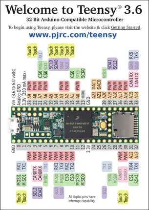
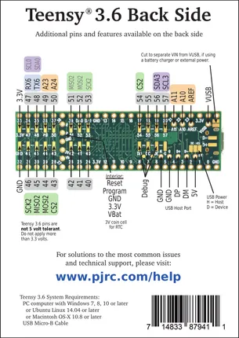

# Teensy 3.6

**PJRC** · NXP ARM

Revision: Not identified  
Coverage: Pinout image collected

[Browse all manufacturers](../../../../BROWSE.md) · [Desktop app](https://github.com/valleytechsolutions/black-wire-desktop)

## Pin Assignments, Front Side

**pinout image** · Reviewed source · PNG

[Open original reference](../../../../library/media/faa65dca3ea595dbfdf8c868926f8a442e3b49ae9eb5e4faed9ec44d23bc5739.png)

**Credit and rights:** Not established; source attribution retained. Source/manufacturer: PJRC.

[Source 1](https://www.pjrc.com/teensy/card9a_rev2_web.pdf) · [Source 2](https://www.pjrc.com/teensy/pinout.html)

 Original PDF page 1 rendered at 220 dpi; no labels changed.

SHA-256: `faa65dca3ea595dbfdf8c868926f8a442e3b49ae9eb5e4faed9ec44d23bc5739`

## Pin Assignments, Back Side

**pinout image** · Reviewed source · PNG

[Open original reference](../../../../library/media/428a4d0026c881c66648d333c9c120794bc0e6cf35ddbbb3ce69c6115b6debe6.png)

**Credit and rights:** Not established; source attribution retained. Source/manufacturer: PJRC.

[Source 1](https://www.pjrc.com/teensy/card9b_rev2_web.pdf) · [Source 2](https://www.pjrc.com/teensy/pinout.html)

 Original PDF page 1 rendered at 220 dpi; no labels changed.

SHA-256: `428a4d0026c881c66648d333c9c120794bc0e6cf35ddbbb3ce69c6115b6debe6`

## Pin Assignments, Front Side

**original reference PDF** · Reviewed source · PDF

[Open original reference](../../../../library/media/384391ee9157665ab7bd414fec9407b6517149222da765d8f45fffc8c6516f4b.pdf)

**Credit and rights:** Not established; source attribution retained. Source/manufacturer: PJRC.

[Source 1](https://www.pjrc.com/teensy/card9a_rev2_web.pdf) · [Source 2](https://www.pjrc.com/teensy/pinout.html)

SHA-256: `384391ee9157665ab7bd414fec9407b6517149222da765d8f45fffc8c6516f4b`

## Pin Assignments, Back Side

**original reference PDF** · Reviewed source · PDF

[Open original reference](../../../../library/media/60d25828b76de8827d7dfddbcab7dddd91cb7165e490cd620e9261222fbee677.pdf)

**Credit and rights:** Not established; source attribution retained. Source/manufacturer: PJRC.

[Source 1](https://www.pjrc.com/teensy/card9b_rev2_web.pdf) · [Source 2](https://www.pjrc.com/teensy/pinout.html)

SHA-256: `60d25828b76de8827d7dfddbcab7dddd91cb7165e490cd620e9261222fbee677`

Pin assignments have not been independently electrically verified. Check board revision before wiring.
