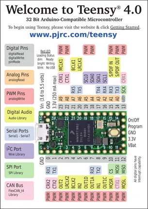
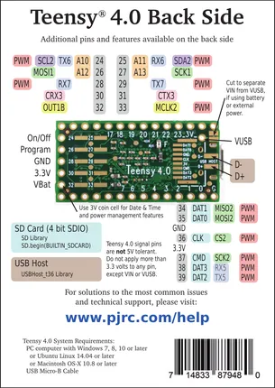

# Teensy 4.0

**PJRC** · NXP ARM

Revision: Not identified  
Coverage: Pinout image collected

[Browse all manufacturers](../../../../BROWSE.md) · [Desktop app](https://github.com/valleytechsolutions/black-wire-desktop)

## Pin Assignments, Front Side

**pinout image** · Reviewed source · PNG

[Open original reference](../../../../library/media/b91c374d26b4378cadaf8c7b65fd1e7ea8fda56ed482877f5baf6e1375227c5d.png)

**Credit and rights:** Not established; source attribution retained. Source/manufacturer: PJRC.

[Source 1](https://www.pjrc.com/teensy/card10a_rev2_web.pdf) · [Source 2](https://www.pjrc.com/teensy/pinout.html)

 Original PDF page 1 rendered at 220 dpi; no labels changed.

SHA-256: `b91c374d26b4378cadaf8c7b65fd1e7ea8fda56ed482877f5baf6e1375227c5d`

## Pin Assignments, Back Side

**pinout image** · Reviewed source · PNG

[Open original reference](../../../../library/media/51d2244129045781abae20d5787517f78c0cda1516b6a4ad793bd3a4a3408141.png)

**Credit and rights:** Not established; source attribution retained. Source/manufacturer: PJRC.

[Source 1](https://www.pjrc.com/teensy/card10b_rev2_web.pdf) · [Source 2](https://www.pjrc.com/teensy/pinout.html)

 Original PDF page 1 rendered at 220 dpi; no labels changed.

SHA-256: `51d2244129045781abae20d5787517f78c0cda1516b6a4ad793bd3a4a3408141`

## Pin Assignments, Front Side

**original reference PDF** · Reviewed source · PDF

[Open original reference](../../../../library/media/d82c571a658942bdac3c7468aca8a6ac21fe8a4466c67b303d46a1b96ec1e1e9.pdf)

**Credit and rights:** Not established; source attribution retained. Source/manufacturer: PJRC.

[Source 1](https://www.pjrc.com/teensy/card10a_rev2_web.pdf) · [Source 2](https://www.pjrc.com/teensy/pinout.html)

SHA-256: `d82c571a658942bdac3c7468aca8a6ac21fe8a4466c67b303d46a1b96ec1e1e9`

## Pin Assignments, Back Side

**original reference PDF** · Reviewed source · PDF

[Open original reference](../../../../library/media/d422f1ba2e4d569ce5080514bba6ad78b2f7d0faa986e62c72db0b9757f57c29.pdf)

**Credit and rights:** Not established; source attribution retained. Source/manufacturer: PJRC.

[Source 1](https://www.pjrc.com/teensy/card10b_rev2_web.pdf) · [Source 2](https://www.pjrc.com/teensy/pinout.html)

SHA-256: `d422f1ba2e4d569ce5080514bba6ad78b2f7d0faa986e62c72db0b9757f57c29`

Pin assignments have not been independently electrically verified. Check board revision before wiring.
