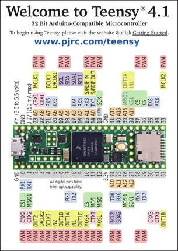
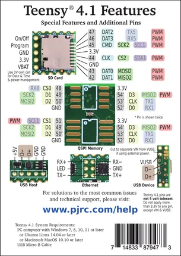

# Teensy 4.1

**PJRC** · NXP ARM

Revision: Not identified  
Coverage: Pinout image collected

[Browse all manufacturers](../../../../BROWSE.md) · [Desktop app](https://github.com/valleytechsolutions/black-wire-desktop)

## Pin Assignments, Front Side

**pinout image** · Reviewed source · PNG

[Open original reference](../../../../library/media/6a472377753aa30d5ea4c1223ea053d21559b768eb72e119471e75306fb14007.png)

**Credit and rights:** Not established; source attribution retained. Source/manufacturer: PJRC.

[Source 1](https://www.pjrc.com/teensy/card11a_rev4_web.pdf) · [Source 2](https://www.pjrc.com/teensy/pinout.html)

 Original PDF page 1 rendered at 220 dpi; no labels changed.

SHA-256: `6a472377753aa30d5ea4c1223ea053d21559b768eb72e119471e75306fb14007`

## Pin Assignments, Back Side

**pinout image** · Reviewed source · PNG

[Open original reference](../../../../library/media/475c1605a99028c3bcaceee9588b7b5e594419848499b376a0835276d641a3f4.png)

**Credit and rights:** Not established; source attribution retained. Source/manufacturer: PJRC.

[Source 1](https://www.pjrc.com/teensy/card11b_rev4_web.pdf) · [Source 2](https://www.pjrc.com/teensy/pinout.html)

 Original PDF page 1 rendered at 220 dpi; no labels changed.

SHA-256: `475c1605a99028c3bcaceee9588b7b5e594419848499b376a0835276d641a3f4`

## Pin Assignments, Front Side

**original reference PDF** · Reviewed source · PDF

[Open original reference](../../../../library/media/d8e8f77658a43eddd3254fcf7c248e200f8a83a398b990382ee1f71f500debf0.pdf)

**Credit and rights:** Not established; source attribution retained. Source/manufacturer: PJRC.

[Source 1](https://www.pjrc.com/teensy/card11a_rev4_web.pdf) · [Source 2](https://www.pjrc.com/teensy/pinout.html)

SHA-256: `d8e8f77658a43eddd3254fcf7c248e200f8a83a398b990382ee1f71f500debf0`

## Pin Assignments, Back Side

**original reference PDF** · Reviewed source · PDF

[Open original reference](../../../../library/media/9b258db98f6ef2a4afe21af4820fb599f1362adc1f600536955c3cd4f283c273.pdf)

**Credit and rights:** Not established; source attribution retained. Source/manufacturer: PJRC.

[Source 1](https://www.pjrc.com/teensy/card11b_rev4_web.pdf) · [Source 2](https://www.pjrc.com/teensy/pinout.html)

SHA-256: `9b258db98f6ef2a4afe21af4820fb599f1362adc1f600536955c3cd4f283c273`

Pin assignments have not been independently electrically verified. Check board revision before wiring.
