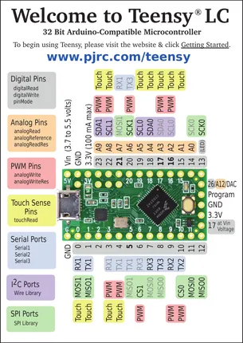
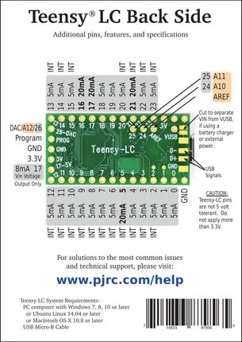

# Teensy LC

**PJRC** · NXP ARM

Revision: Not identified  
Coverage: Pinout image collected

[Browse all manufacturers](../../../../BROWSE.md) · [Desktop app](https://github.com/valleytechsolutions/black-wire-desktop)

## Pin Assignments, Front Side

**pinout image** · Reviewed source · PNG

[Open original reference](../../../../library/media/1d2db7835e6f6ad34981720bbfa00ad8e733fe9adacf384d84d2161afbb7bef2.png)

**Credit and rights:** Not established; source attribution retained. Source/manufacturer: PJRC.

[Source 1](https://www.pjrc.com/teensy/card6a_rev4_web.pdf) · [Source 2](https://www.pjrc.com/teensy/pinout.html)

 Original PDF page 1 rendered at 220 dpi; no labels changed.

SHA-256: `1d2db7835e6f6ad34981720bbfa00ad8e733fe9adacf384d84d2161afbb7bef2`

## Pin Assignments, Back Side

**pinout image** · Reviewed source · PNG

[Open original reference](../../../../library/media/143de187a102af5dbb6b54a7fde8b91f1db09d00fe7c1471d1e6dcd6b8f9d2f7.png)

**Credit and rights:** Not established; source attribution retained. Source/manufacturer: PJRC.

[Source 1](https://www.pjrc.com/teensy/card6b_rev4_web.pdf) · [Source 2](https://www.pjrc.com/teensy/pinout.html)

 Original PDF page 1 rendered at 220 dpi; no labels changed.

SHA-256: `143de187a102af5dbb6b54a7fde8b91f1db09d00fe7c1471d1e6dcd6b8f9d2f7`

## Pin Assignments, Front Side

**original reference PDF** · Reviewed source · PDF

[Open original reference](../../../../library/media/911a75721eb017977c1dd1fdc1e1819407b5f789ff52ed0aaa2f587413dd30a2.pdf)

**Credit and rights:** Not established; source attribution retained. Source/manufacturer: PJRC.

[Source 1](https://www.pjrc.com/teensy/card6a_rev4_web.pdf) · [Source 2](https://www.pjrc.com/teensy/pinout.html)

SHA-256: `911a75721eb017977c1dd1fdc1e1819407b5f789ff52ed0aaa2f587413dd30a2`

## Pin Assignments, Back Side

**original reference PDF** · Reviewed source · PDF

[Open original reference](../../../../library/media/c0d6daafc4564cc1e15ba94ff5d531bdda7271ffde975b381ace52bcb2a13e77.pdf)

**Credit and rights:** Not established; source attribution retained. Source/manufacturer: PJRC.

[Source 1](https://www.pjrc.com/teensy/card6b_rev4_web.pdf) · [Source 2](https://www.pjrc.com/teensy/pinout.html)

SHA-256: `c0d6daafc4564cc1e15ba94ff5d531bdda7271ffde975b381ace52bcb2a13e77`

Pin assignments have not been independently electrically verified. Check board revision before wiring.
