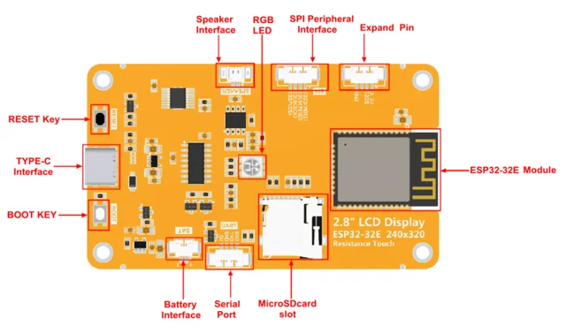

# E32R28T ESP32-32E 2.8-inch resistive display

**QDtech** · ESP32-WROOM-32E

Revision: Board PCB revision not established; official specification V1.0

Coverage: Supporting references; complete physical pinout still needed

[Browse all manufacturers](../../../../BROWSE.md) · [Devices & IoT](../../../../DEVICES.md) · [Open in the browser guide](https://valleytech-black-wire-guide.pages.dev/?board=qdtech-e32r28t)

Device category: **Displays & HMI**

Source identity and visual type reviewed; electrical limits and pin assignments have not been independently bench-verified. Match the exact PCB, connector orientation and interface mode. Resistive-touch model E32R28T only. The shared manual also describes a non-touch E32N variant; that does not establish identical populated hardware. HaleHound kit wiring is a separate assembly reference.

Architecture: **Xtensa**

## Datasheets and original documentation

Board datasheet: **recorded**. Visual reference: **available**.

[Original publisher / manufacturer documentation](https://www.lcdwiki.com/2.8inch_ESP32-32E_Display)

- **datasheet / board**: [2.8-inch ESP32-32E display module Specification](https://www.lcdwiki.com/res/E32R28T/E32R28T_E32N28T_Specification_V1.0.pdf) · [saved document](../../../../library/media/9582395f8b87adaf445daf2edda7121390b624fbebd28542e738d14d6ce2cba0.pdf)
- **hardware-guide / board**: [2.8-inch ESP32-32E display module User Manual](https://www.lcdwiki.com/res/E32R28T/2.8inch_ESP32-32E_E32R28T_E32N28T_User_Manual.pdf) · [saved document](../../../../library/media/746d47d8a6521f900dd2e435263b01f861063e7f14edbeda849d5bef9d5ac3e7.pdf)
- **schematic / board**: [2.8-inch ESP32-32E display module Schematic diagram](https://www.lcdwiki.com/res/E32R28T/2.8inch_ESP32-32_Display_Schematic.pdf) · [saved document](../../../../library/media/be26846ba27cc9c49ada43465897e34d1a8709c53bd9f097c8a83c9270d175e4.pdf)

Source identity and visual type reviewed; electrical limits and pin assignments have not been independently bench-verified. Match the exact PCB, connector orientation and interface mode. Resistive-touch model E32R28T only. The shared manual also describes a non-touch E32N variant; that does not establish identical populated hardware. HaleHound kit wiring is a separate assembly reference.

[Documentation coverage and remaining gaps](../../../../DOCUMENTATION.md)

## Specifications and hardware documentation

- [Original hardware documentation](https://www.lcdwiki.com/2.8inch_ESP32-32E_Display)

## E32R28T — connector and component groups (not an all-pin map)

**board labeling image** · Source image / document inspected; independent electrical review pending · PNG

[Open original reference](../../../../library/media/61517cd47fc1aa19f35c6456bedebc04c4f8481d3a3e59b644d1ce36d52acea9.png)

**Credit and rights:** QDtech / original diagram and document contributors. Asset-specific redistribution and print rights are not established. Black Wire's editorial license does not relicense this artwork.. Source/manufacturer: QDtech.

[Source 1](https://www.lcdwiki.com/images/thumb/c/c2/E32R28T-06-1.png/861px-E32R28T-06-1.png) · [Source 2](https://www.lcdwiki.com/2.8inch_ESP32-32E_Display)

Source identity and visual type reviewed; electrical limits and pin assignments have not been independently bench-verified. Match the exact PCB, connector orientation and interface mode. Resistive-touch model E32R28T only. The shared manual also describes a non-touch E32N variant; that does not establish identical populated hardware. HaleHound kit wiring is a separate assembly reference.

Image revision: Board PCB revision not established; official specification V1.0

SHA-256: `61517cd47fc1aa19f35c6456bedebc04c4f8481d3a3e59b644d1ce36d52acea9`

## 2.8-inch ESP32-32E display module Specification

**original reference PDF** · Source image / document inspected; independent electrical review pending · PDF

[Open original reference](../../../../library/media/9582395f8b87adaf445daf2edda7121390b624fbebd28542e738d14d6ce2cba0.pdf)

**Credit and rights:** QDtech / original diagram and document contributors. Asset-specific redistribution and print rights are not established. Black Wire's editorial license does not relicense this artwork.. Source/manufacturer: QDtech.

[Source 1](https://www.lcdwiki.com/res/E32R28T/E32R28T_E32N28T_Specification_V1.0.pdf) · [Source 2](https://www.lcdwiki.com/2.8inch_ESP32-32E_Display)

Source identity and visual type reviewed; electrical limits and pin assignments have not been independently bench-verified. Match the exact PCB, connector orientation and interface mode. Resistive-touch model E32R28T only. The shared manual also describes a non-touch E32N variant; that does not establish identical populated hardware. HaleHound kit wiring is a separate assembly reference.

Image revision: Board PCB revision not established; official specification V1.0

SHA-256: `9582395f8b87adaf445daf2edda7121390b624fbebd28542e738d14d6ce2cba0`

## 2.8-inch ESP32-32E display module User Manual

**original reference PDF** · Source image / document inspected; independent electrical review pending · PDF

[Open original reference](../../../../library/media/746d47d8a6521f900dd2e435263b01f861063e7f14edbeda849d5bef9d5ac3e7.pdf)

**Credit and rights:** QDtech / original diagram and document contributors. Asset-specific redistribution and print rights are not established. Black Wire's editorial license does not relicense this artwork.. Source/manufacturer: QDtech.

[Source 1](https://www.lcdwiki.com/res/E32R28T/2.8inch_ESP32-32E_E32R28T_E32N28T_User_Manual.pdf) · [Source 2](https://www.lcdwiki.com/2.8inch_ESP32-32E_Display)

Source identity and visual type reviewed; electrical limits and pin assignments have not been independently bench-verified. Match the exact PCB, connector orientation and interface mode. Resistive-touch model E32R28T only. The shared manual also describes a non-touch E32N variant; that does not establish identical populated hardware. HaleHound kit wiring is a separate assembly reference.

Image revision: Board PCB revision not established; official specification V1.0

SHA-256: `746d47d8a6521f900dd2e435263b01f861063e7f14edbeda849d5bef9d5ac3e7`

## 2.8-inch ESP32-32E display module Schematic diagram

**original reference PDF** · Source image / document inspected; independent electrical review pending · PDF

[Open original reference](../../../../library/media/be26846ba27cc9c49ada43465897e34d1a8709c53bd9f097c8a83c9270d175e4.pdf)

**Credit and rights:** QDtech / original diagram and document contributors. Asset-specific redistribution and print rights are not established. Black Wire's editorial license does not relicense this artwork.. Source/manufacturer: QDtech.

[Source 1](https://www.lcdwiki.com/res/E32R28T/2.8inch_ESP32-32_Display_Schematic.pdf) · [Source 2](https://www.lcdwiki.com/2.8inch_ESP32-32E_Display)

Source identity and visual type reviewed; electrical limits and pin assignments have not been independently bench-verified. Match the exact PCB, connector orientation and interface mode. Resistive-touch model E32R28T only. The shared manual also describes a non-touch E32N variant; that does not establish identical populated hardware. HaleHound kit wiring is a separate assembly reference.

Image revision: Board PCB revision not established; official specification V1.0

SHA-256: `be26846ba27cc9c49ada43465897e34d1a8709c53bd9f097c8a83c9270d175e4`

Pin assignments have not been independently electrically verified. Check board revision before wiring.
