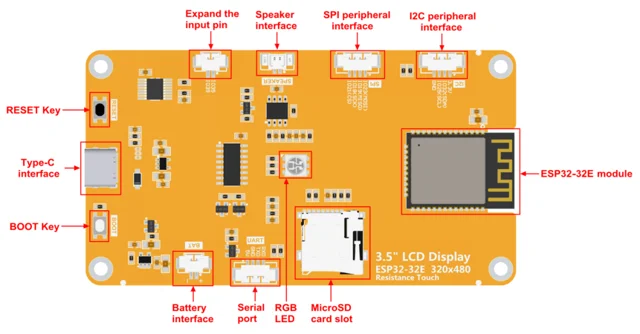

# E32R35T ESP32-32E 3.5-inch resistive display

**QDtech** · ESP32-WROOM-32E

Revision: Board PCB revision not established; official specification V1.0

Coverage: Supporting references; complete physical pinout still needed

[Browse all manufacturers](../../../../BROWSE.md) · [Devices & IoT](../../../../DEVICES.md) · [Open in the browser guide](https://valleytech-black-wire-guide.pages.dev/?board=qdtech-e32r35t)

Device category: **Displays & HMI**

Source identity and visual type reviewed; electrical limits and pin assignments have not been independently bench-verified. Match the exact PCB, connector orientation and interface mode. Resistive-touch model E32R35T only. The shared manual also describes a non-touch E32N variant; that does not establish identical populated hardware. HaleHound kit wiring is a separate assembly reference.

Architecture: **Xtensa**

## Datasheets and original documentation

Board datasheet: **recorded**. Visual reference: **available**.

[Original publisher / manufacturer documentation](https://www.lcdwiki.com/3.5inch_ESP32-32E_Display)

- **datasheet / board**: [3.5-inch ESP32-32E display module Specification](https://www.lcdwiki.com/res/E32R35T/E32R35T_E32N35T_Specification_V1.0.pdf) · [saved document](../../../../library/media/258dd300ff60f357c64d0fc000729471e3395645b02cc8f2140e31386df3e3e8.pdf)
- **hardware-guide / board**: [3.5-inch ESP32-32E display module User Manual](https://www.lcdwiki.com/res/E32R35T/3.5inch_ESP32-32E_E32R35T_E32N35T_User_Manual.pdf) · [saved document](../../../../library/media/3b7f38e553d2e5f34eaf75146d65aea097df5ed5d15ab796b4f8dc9b81853257.pdf)
- **schematic / board**: [3.5-inch E32R35T display module Schematic diagram](https://www.lcdwiki.com/res/E32R35T/3.5inch_ESP32-32E_E32R35T_Schematic.pdf) · [saved document](../../../../library/media/da2aed2f72113cea9b8788b1c263b2467c5f56333b2759712e0862ed27488ac9.pdf)

Source identity and visual type reviewed; electrical limits and pin assignments have not been independently bench-verified. Match the exact PCB, connector orientation and interface mode. Resistive-touch model E32R35T only. The shared manual also describes a non-touch E32N variant; that does not establish identical populated hardware. HaleHound kit wiring is a separate assembly reference.

[Documentation coverage and remaining gaps](../../../../DOCUMENTATION.md)

## Specifications and hardware documentation

- [Original hardware documentation](https://www.lcdwiki.com/3.5inch_ESP32-32E_Display)

## E32R35T — connector and component groups (not an all-pin map)

**board labeling image** · Source image / document inspected; independent electrical review pending · PNG

[Open original reference](../../../../library/media/85511330df24e5a7be0dd868c86741058a839f5ef55df9fe0263972a06edb1f8.png)

**Credit and rights:** QDtech / original diagram and document contributors. Asset-specific redistribution and print rights are not established. Black Wire's editorial license does not relicense this artwork.. Source/manufacturer: QDtech.

[Source 1](https://www.lcdwiki.com/images/thumb/9/9b/E32R35T-06-1.png/861px-E32R35T-06-1.png) · [Source 2](https://www.lcdwiki.com/3.5inch_ESP32-32E_Display)

Source identity and visual type reviewed; electrical limits and pin assignments have not been independently bench-verified. Match the exact PCB, connector orientation and interface mode. Resistive-touch model E32R35T only. The shared manual also describes a non-touch E32N variant; that does not establish identical populated hardware. HaleHound kit wiring is a separate assembly reference.

Image revision: Board PCB revision not established; official specification V1.0

SHA-256: `85511330df24e5a7be0dd868c86741058a839f5ef55df9fe0263972a06edb1f8`

## 3.5-inch ESP32-32E display module Specification

**original reference PDF** · Source image / document inspected; independent electrical review pending · PDF

[Open original reference](../../../../library/media/258dd300ff60f357c64d0fc000729471e3395645b02cc8f2140e31386df3e3e8.pdf)

**Credit and rights:** QDtech / original diagram and document contributors. Asset-specific redistribution and print rights are not established. Black Wire's editorial license does not relicense this artwork.. Source/manufacturer: QDtech.

[Source 1](https://www.lcdwiki.com/res/E32R35T/E32R35T_E32N35T_Specification_V1.0.pdf) · [Source 2](https://www.lcdwiki.com/3.5inch_ESP32-32E_Display)

Source identity and visual type reviewed; electrical limits and pin assignments have not been independently bench-verified. Match the exact PCB, connector orientation and interface mode. Resistive-touch model E32R35T only. The shared manual also describes a non-touch E32N variant; that does not establish identical populated hardware. HaleHound kit wiring is a separate assembly reference.

Image revision: Board PCB revision not established; official specification V1.0

SHA-256: `258dd300ff60f357c64d0fc000729471e3395645b02cc8f2140e31386df3e3e8`

## 3.5-inch ESP32-32E display module User Manual

**original reference PDF** · Source image / document inspected; independent electrical review pending · PDF

[Open original reference](../../../../library/media/3b7f38e553d2e5f34eaf75146d65aea097df5ed5d15ab796b4f8dc9b81853257.pdf)

**Credit and rights:** QDtech / original diagram and document contributors. Asset-specific redistribution and print rights are not established. Black Wire's editorial license does not relicense this artwork.. Source/manufacturer: QDtech.

[Source 1](https://www.lcdwiki.com/res/E32R35T/3.5inch_ESP32-32E_E32R35T_E32N35T_User_Manual.pdf) · [Source 2](https://www.lcdwiki.com/3.5inch_ESP32-32E_Display)

Source identity and visual type reviewed; electrical limits and pin assignments have not been independently bench-verified. Match the exact PCB, connector orientation and interface mode. Resistive-touch model E32R35T only. The shared manual also describes a non-touch E32N variant; that does not establish identical populated hardware. HaleHound kit wiring is a separate assembly reference.

Image revision: Board PCB revision not established; official specification V1.0

SHA-256: `3b7f38e553d2e5f34eaf75146d65aea097df5ed5d15ab796b4f8dc9b81853257`

## 3.5-inch E32R35T display module Schematic diagram

**original reference PDF** · Source image / document inspected; independent electrical review pending · PDF

[Open original reference](../../../../library/media/da2aed2f72113cea9b8788b1c263b2467c5f56333b2759712e0862ed27488ac9.pdf)

**Credit and rights:** QDtech / original diagram and document contributors. Asset-specific redistribution and print rights are not established. Black Wire's editorial license does not relicense this artwork.. Source/manufacturer: QDtech.

[Source 1](https://www.lcdwiki.com/res/E32R35T/3.5inch_ESP32-32E_E32R35T_Schematic.pdf) · [Source 2](https://www.lcdwiki.com/3.5inch_ESP32-32E_Display)

Source identity and visual type reviewed; electrical limits and pin assignments have not been independently bench-verified. Match the exact PCB, connector orientation and interface mode. Resistive-touch model E32R35T only. The shared manual also describes a non-touch E32N variant; that does not establish identical populated hardware. HaleHound kit wiring is a separate assembly reference.

Image revision: Board PCB revision not established; official specification V1.0

SHA-256: `da2aed2f72113cea9b8788b1c263b2467c5f56333b2759712e0862ed27488ac9`

Pin assignments have not been independently electrically verified. Check board revision before wiring.
