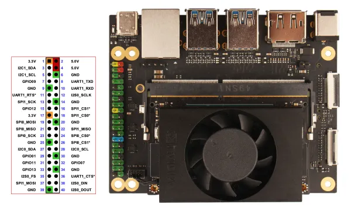
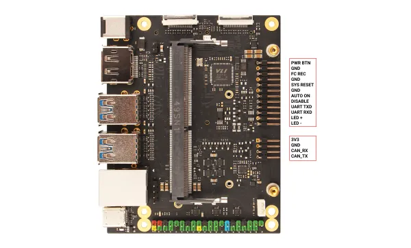

# C200

**Radxa** · Other SBC

Revision: Not identified  
Coverage: Pinout image collected

[Browse all manufacturers](../../../../BROWSE.md) · [Desktop app](https://github.com/valleytechsolutions/black-wire-desktop)

## c200-40-pin-gpio

**pinout image** · Reviewed source · WEBP

[Open original reference](../../../../library/media/e6958ada74b4b616c65fbdad4dc582477f9f9e1ce65993ded22327645b777637.webp)

**Credit and rights:** Not established; source attribution retained. Source/manufacturer: Radxa.

[Source 1](https://raw.githubusercontent.com/radxa-docs/docs/df97d99c4e1a12f8f9d2afb129ed86bc33c050b5/static/img/c200/c200-40-pin-gpio.webp) · [Source 2](https://github.com/radxa-docs/docs/blob/df97d99c4e1a12f8f9d2afb129ed86bc33c050b5/static/img/c200/c200-40-pin-gpio.webp)

SHA-256: `e6958ada74b4b616c65fbdad4dc582477f9f9e1ce65993ded22327645b777637`

## c200-other-gpio

**pinout image** · Reviewed source · WEBP

[Open original reference](../../../../library/media/8d77a00073fe46f82ce5e8ca6f7a8df6e90a166ec85ef1fde284c0b7ff253725.webp)

**Credit and rights:** Not established; source attribution retained. Source/manufacturer: Radxa.

[Source 1](https://raw.githubusercontent.com/radxa-docs/docs/df97d99c4e1a12f8f9d2afb129ed86bc33c050b5/static/img/c200/c200-other-gpio.webp) · [Source 2](https://github.com/radxa-docs/docs/blob/df97d99c4e1a12f8f9d2afb129ed86bc33c050b5/static/img/c200/c200-other-gpio.webp)

SHA-256: `8d77a00073fe46f82ce5e8ca6f7a8df6e90a166ec85ef1fde284c0b7ff253725`

Pin assignments have not been independently electrically verified. Check board revision before wiring.
