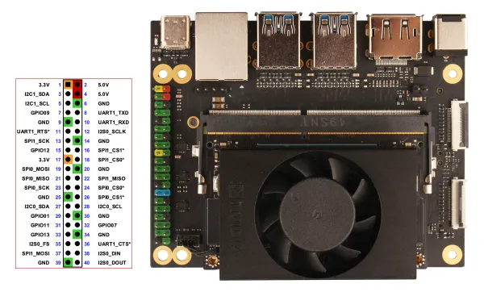
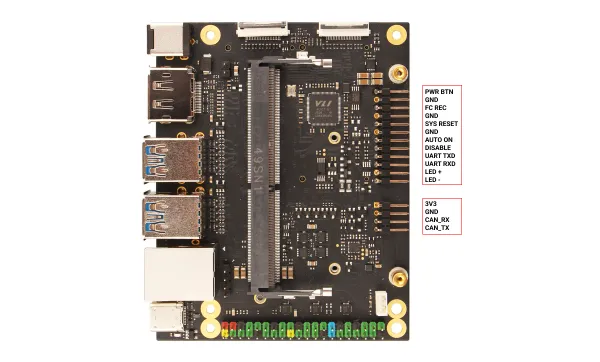

# C200

**Radxa** · Other SBC

Revision: Not identified

Coverage: Pinout image collected

[Browse all manufacturers](../../../../BROWSE.md) · [Devices & IoT](../../../../DEVICES.md) · [Open in the browser guide](https://valleytech-black-wire-guide.pages.dev/?board=radxa-other-sbc-c200)

## Datasheets and original documentation

Board datasheet: **not yet recorded**. Visual reference: **available**.

Original manufacturer website still needs identification.

A chip datasheet, schematic and board datasheet have different scopes. Match the exact hardware revision.

[Documentation coverage and remaining gaps](../../../../DOCUMENTATION.md)

## c200-40-pin-gpio

**pinout image** · Reviewed source · WEBP

[Open original reference](../../../../library/media/e6958ada74b4b616c65fbdad4dc582477f9f9e1ce65993ded22327645b777637.webp)

**Credit and rights:** Not established; source attribution retained. Source/manufacturer: Radxa.

[Source 1](https://raw.githubusercontent.com/radxa-docs/docs/df97d99c4e1a12f8f9d2afb129ed86bc33c050b5/static/img/c200/c200-40-pin-gpio.webp) · [Source 2](https://github.com/radxa-docs/docs/blob/df97d99c4e1a12f8f9d2afb129ed86bc33c050b5/static/img/c200/c200-40-pin-gpio.webp)

Image revision: Not identified

SHA-256: `e6958ada74b4b616c65fbdad4dc582477f9f9e1ce65993ded22327645b777637`

## c200-other-gpio

**pinout image** · Reviewed source · WEBP

[Open original reference](../../../../library/media/8d77a00073fe46f82ce5e8ca6f7a8df6e90a166ec85ef1fde284c0b7ff253725.webp)

**Credit and rights:** Not established; source attribution retained. Source/manufacturer: Radxa.

[Source 1](https://raw.githubusercontent.com/radxa-docs/docs/df97d99c4e1a12f8f9d2afb129ed86bc33c050b5/static/img/c200/c200-other-gpio.webp) · [Source 2](https://github.com/radxa-docs/docs/blob/df97d99c4e1a12f8f9d2afb129ed86bc33c050b5/static/img/c200/c200-other-gpio.webp)

Image revision: Not identified

SHA-256: `8d77a00073fe46f82ce5e8ca6f7a8df6e90a166ec85ef1fde284c0b7ff253725`

Pin assignments have not been independently electrically verified. Check board revision before wiring.
