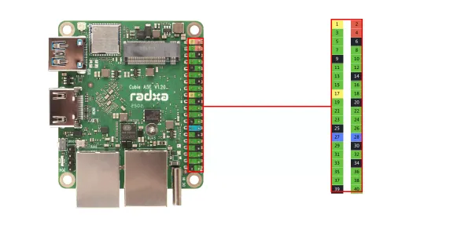

# Cubie A5E

**Radxa** · Other SBC

Revision: Not identified  
Coverage: Board labels only; pinout needed

[Browse all manufacturers](../../../../BROWSE.md) · [Desktop app](https://github.com/valleytechsolutions/black-wire-desktop)

## Header orientation and board labels

**board labeling image** · Reviewed source · WEBP

[Open original reference](../../../../library/media/6ee08f5e307a72efad6689d7b220f187ff986fd9ee5c093093a83979b8079568.webp)

**Credit and rights:** Not established; source attribution retained. Source/manufacturer: Radxa.

[Source 1](https://raw.githubusercontent.com/radxa-docs/docs/df97d99c4e1a12f8f9d2afb129ed86bc33c050b5/static/img/cubie/a5e/a5e_gpio.webp) · [Source 2](https://github.com/radxa-docs/docs/blob/df97d99c4e1a12f8f9d2afb129ed86bc33c050b5/static/img/cubie/a5e/a5e_gpio.webp)

SHA-256: `6ee08f5e307a72efad6689d7b220f187ff986fd9ee5c093093a83979b8079568`

Pin assignments have not been independently electrically verified. Check board revision before wiring.
