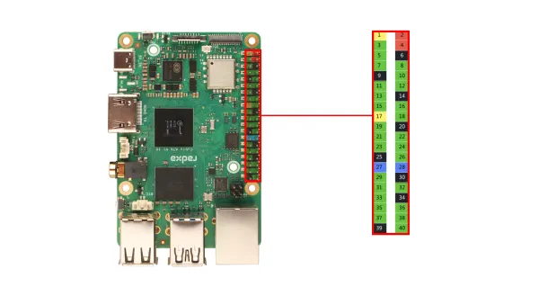

# Cubie A7A

**Radxa** · Other SBC

Revision: Not identified

Coverage: Board labels only; pinout needed

[Browse all manufacturers](../../../../BROWSE.md) · [Devices & IoT](../../../../DEVICES.md) · [Open in the browser guide](https://valleytech-black-wire-guide.pages.dev/?board=radxa-other-sbc-cubie-a7a)

## Datasheets and original documentation

Board datasheet: **not yet recorded**. Visual reference: **available**.

Original manufacturer website still needs identification.

A chip datasheet, schematic and board datasheet have different scopes. Match the exact hardware revision.

[Documentation coverage and remaining gaps](../../../../DOCUMENTATION.md)

## Header orientation and board labels

**board labeling image** · Reviewed source · WEBP

[Open original reference](../../../../library/media/75f3527d0f6742786a42c1efd535a9d74054de23e781f434d5f1297d689262ac.webp)

**Credit and rights:** Not established; source attribution retained. Source/manufacturer: Radxa.

[Source 1](https://raw.githubusercontent.com/radxa-docs/docs/df97d99c4e1a12f8f9d2afb129ed86bc33c050b5/static/img/cubie/a7a/a7a-gpio.webp) · [Source 2](https://github.com/radxa-docs/docs/blob/df97d99c4e1a12f8f9d2afb129ed86bc33c050b5/static/img/cubie/a7a/a7a-gpio.webp)

Image revision: Not identified

SHA-256: `75f3527d0f6742786a42c1efd535a9d74054de23e781f434d5f1297d689262ac`

Pin assignments have not been independently electrically verified. Check board revision before wiring.
