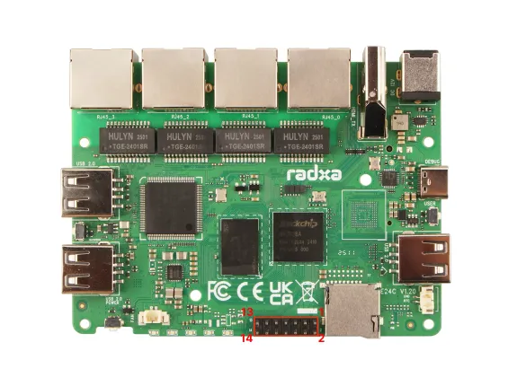

# E24C

**Radxa** · Other SBC

Revision: Not identified  
Coverage: Board labels only; pinout needed

[Browse all manufacturers](../../../../BROWSE.md) · [Desktop app](https://github.com/valleytechsolutions/black-wire-desktop)

## Header orientation and board labels

**board labeling image** · Reviewed source · WEBP

[Open original reference](../../../../library/media/24c1317f560ab5fccc261a22fddb3f4f7c6b449466aef6e5295cebcbcdddd55d.webp)

**Credit and rights:** Not established; source attribution retained. Source/manufacturer: Radxa.

[Source 1](https://raw.githubusercontent.com/radxa-docs/docs/df97d99c4e1a12f8f9d2afb129ed86bc33c050b5/static/img/e/e24c/e24c-gpio-pinout.webp) · [Source 2](https://github.com/radxa-docs/docs/blob/df97d99c4e1a12f8f9d2afb129ed86bc33c050b5/static/img/e/e24c/e24c-gpio-pinout.webp)

SHA-256: `24c1317f560ab5fccc261a22fddb3f4f7c6b449466aef6e5295cebcbcdddd55d`

Pin assignments have not been independently electrically verified. Check board revision before wiring.
