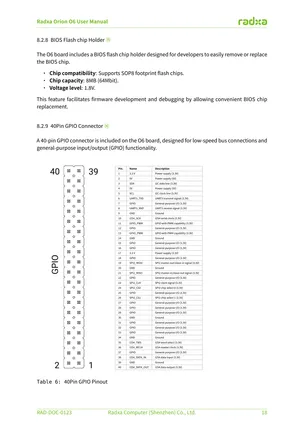
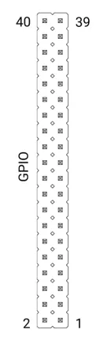

# Orion O6

**Radxa** · Other SBC

Revision: Not identified  
Coverage: Pinout image collected

[Browse all manufacturers](../../../../BROWSE.md) · [Desktop app](https://github.com/valleytechsolutions/black-wire-desktop)

## 40-pin GPIO reference page 19

**pinout image** · Reviewed source · PNG

[Open original reference](../../../../library/media/2088bce3efcbde103da883af85d8a1f83d1c20cc6f81c4c5b73a119e46d1549f.png)

**Credit and rights:** Not established; source attribution retained. Source/manufacturer: Radxa.

[Source 1](https://dl.radxa.com/orion/o6/docs/radxa_orion_o6_user_manual.pdf) · [Source 2](https://docs.radxa.com/en/orion/o6)

SHA-256: `2088bce3efcbde103da883af85d8a1f83d1c20cc6f81c4c5b73a119e46d1549f`

## Header orientation and board labels

**board labeling image** · Reviewed source · WEBP

[Open original reference](../../../../library/media/38647762ebad98ce83c6a3c2d5617439bd133bebfd34bd7458ba70564d2b4d31.webp)

**Credit and rights:** Not established; source attribution retained. Source/manufacturer: Radxa.

[Source 1](https://raw.githubusercontent.com/radxa-docs/docs/df97d99c4e1a12f8f9d2afb129ed86bc33c050b5/static/img/orion/o6/pinout_gpio.webp) · [Source 2](https://github.com/radxa-docs/docs/blob/df97d99c4e1a12f8f9d2afb129ed86bc33c050b5/static/img/orion/o6/pinout_gpio.webp)

SHA-256: `38647762ebad98ce83c6a3c2d5617439bd133bebfd34bd7458ba70564d2b4d31`

## Manufacturer user manual

**original reference PDF** · Reviewed source · PDF

[Open original reference](../../../../library/media/a7731b3ed59af34e0f02f3228801b744ce2734a937037ca59a7af5182417ca32.pdf)

**Credit and rights:** Not established; source attribution retained. Source/manufacturer: Radxa.

[Source 1](https://dl.radxa.com/orion/o6/docs/radxa_orion_o6_user_manual.pdf) · [Source 2](https://docs.radxa.com/en/orion/o6)

SHA-256: `a7731b3ed59af34e0f02f3228801b744ce2734a937037ca59a7af5182417ca32`

Pin assignments have not been independently electrically verified. Check board revision before wiring.
