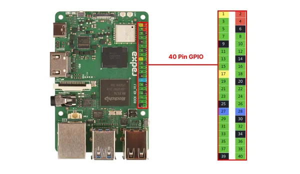

# ROCK 4D

**Radxa** · Other SBC

Revision: Not identified

Coverage: Board labels only; pinout needed

[Browse all manufacturers](../../../../BROWSE.md) · [Devices & IoT](../../../../DEVICES.md) · [Open in the browser guide](https://valleytech-black-wire-guide.pages.dev/?board=radxa-other-sbc-rock-4d)

Architecture: **ARM**

## Specifications and hardware documentation

- [Manufacturer hardware documentation](https://docs.radxa.com/en/rock4/rock4d)

## Header orientation and board labels

**board labeling image** · Reviewed source · WEBP

[Open original reference](../../../../library/media/c50c95413e33583990648c49a617ff2e625ff5997afd3619490a820b04b736e1.webp)

**Credit and rights:** Not established; source attribution retained. Source/manufacturer: Radxa.

[Source 1](https://raw.githubusercontent.com/radxa-docs/docs/df97d99c4e1a12f8f9d2afb129ed86bc33c050b5/static/img/rock4/4d/rock4d-40-pin-gpio.webp) · [Source 2](https://github.com/radxa-docs/docs/blob/df97d99c4e1a12f8f9d2afb129ed86bc33c050b5/static/img/rock4/4d/rock4d-40-pin-gpio.webp)

Image revision: Not identified

SHA-256: `c50c95413e33583990648c49a617ff2e625ff5997afd3619490a820b04b736e1`

Pin assignments have not been independently electrically verified. Check board revision before wiring.
