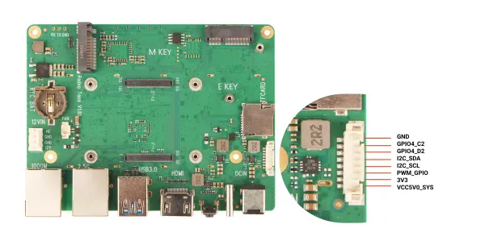

# TACO carrier

**Radxa** · Other SBC

Revision: Not identified  
Coverage: Partial pinout collected; full reference still needed

[Browse all manufacturers](../../../../BROWSE.md) · [Desktop app](https://github.com/valleytechsolutions/black-wire-desktop)

## radxa-taco-gpio

**pinout image** · Reviewed source · WEBP

[Open original reference](../../../../library/media/da0587186b03b2865c5092795f9fb39f58fc0c624a416c073b9fed059a1357bd.webp)

**Credit and rights:** Not established; source attribution retained. Source/manufacturer: Radxa.

[Source 1](https://raw.githubusercontent.com/radxa-docs/docs/df97d99c4e1a12f8f9d2afb129ed86bc33c050b5/static/img/accessories/taco/radxa-taco-gpio.webp) · [Source 2](https://github.com/radxa-docs/docs/blob/df97d99c4e1a12f8f9d2afb129ed86bc33c050b5/static/img/accessories/taco/radxa-taco-gpio.webp)

**Partial diagram. Confirm missing pins against the exact board documentation.**

SHA-256: `da0587186b03b2865c5092795f9fb39f58fc0c624a416c073b9fed059a1357bd`

Pin assignments have not been independently electrically verified. Check board revision before wiring.
