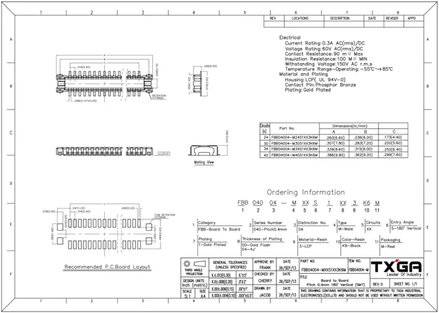
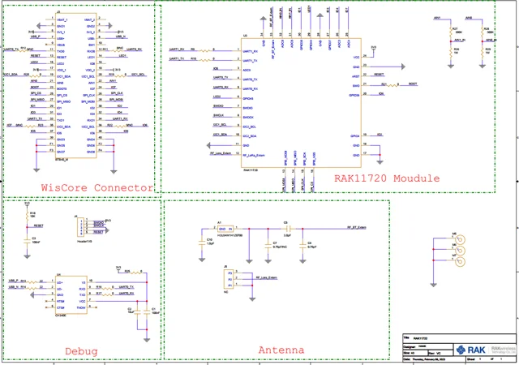

# RAK11722

**RAKwireless** · Apollo3 Blue

Revision: Not identified

Coverage: Supporting references; complete physical pinout still needed

[Browse all manufacturers](../../../../BROWSE.md) · [Devices & IoT](../../../../DEVICES.md) · [Open in the browser guide](https://valleytech-black-wire-guide.pages.dev/?board=rakwireless-other-rak11722)

## Datasheets and original documentation

Board datasheet: **recorded**. Visual reference: **available**.

[Original manufacturer / project documentation](https://docs.rakwireless.com/product-categories/wisblock/rak11722/datasheet/)

- **datasheet / board**: [RAK11722 manufacturer HTML datasheet](https://docs.rakwireless.com/product-categories/wisblock/rak11722/datasheet/) · online

Source identity and visual scope reviewed. Pin assignments and electrical limits are not independently bench-verified. Match the exact PCB revision, connector view and populated options. Core-module castellations, WisConnector numbers and base-board GPIO labels use different numbering. The core-module table must not be used as a physical base-board map.

[Documentation coverage and remaining gaps](../../../../DOCUMENTATION.md)

## RAK11722 — WisConnector PCB footprint and recommendations

**connector reference** · Source visual inspected; independent electrical and all-pin completeness review pending · PNG

[Open original reference](../../../../library/media/d5ddac5af554279267bd461f126d6a9565a69469bb3c8cd1d2b0eb3bd924c999.png)

**Credit and rights:** RAKwireless / original artwork contributors. Asset-specific redistribution and print rights are not established; Black Wire licenses do not relicense this source artwork.. Source/manufacturer: RAKwireless.

[Source 1](https://images.docs.rakwireless.com/wisblock/rak11722/datasheet/wisconnector.png) · [Source 2](https://docs.rakwireless.com/product-categories/wisblock/rak11722/datasheet/)

Source identity and visual scope reviewed. Pin assignments and electrical limits are not independently bench-verified. Match the exact PCB revision, connector view and populated options. Core-module castellations, WisConnector numbers and base-board GPIO labels use different numbering. The core-module table must not be used as a physical base-board map.

Image revision: Not identified

SHA-256: `d5ddac5af554279267bd461f126d6a9565a69469bb3c8cd1d2b0eb3bd924c999`

## RAK11722 — RAK11722 Schematic Diagram

**schematic image** · Source visual inspected; independent electrical and all-pin completeness review pending · PNG

[Open original reference](../../../../library/media/f7a0e5fde494cab221c9661a093ca1833106ea739599a5196d589a7cba8ab2af.png)

**Credit and rights:** RAKwireless / original artwork contributors. Asset-specific redistribution and print rights are not established; Black Wire licenses do not relicense this source artwork.. Source/manufacturer: RAKwireless.

[Source 1](https://images.docs.rakwireless.com/wisblock/rak11722/datasheet/schematic.png) · [Source 2](https://docs.rakwireless.com/product-categories/wisblock/rak11722/datasheet/)

Source identity and visual scope reviewed. Pin assignments and electrical limits are not independently bench-verified. Match the exact PCB revision, connector view and populated options. Core-module castellations, WisConnector numbers and base-board GPIO labels use different numbering. The core-module table must not be used as a physical base-board map.

Image revision: Not identified

SHA-256: `f7a0e5fde494cab221c9661a093ca1833106ea739599a5196d589a7cba8ab2af`

Pin assignments have not been independently electrically verified. Check board revision before wiring.
