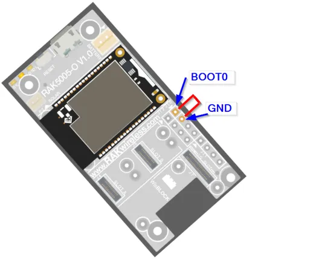

# RAK11200

**RAKwireless** · ESP32 original

Revision: Not identified  
Coverage: Partial pinout collected; full reference still needed

[Browse all manufacturers](../../../../BROWSE.md) · [Desktop app](https://github.com/valleytechsolutions/black-wire-desktop)

## Force ESP32 Download mode

**pinout image** · Reviewed source · PNG

[Open original reference](../../../../library/media/5e0834453ee805bc72e8e5d43854c95f0526833af48e91335ab17c1ac15e31ce.png)

**Credit and rights:** Not established; source attribution retained. Source/manufacturer: RAKwireless.

[Source 1](https://raw.githubusercontent.com/RAKWireless/RAKwireless-docs/4361f2635b6e16c72a46167a208db87427106bef/docs/.vuepress/public/assets/images/wisblock/rak11200/quickstart/rak11200-Boot0-for-flashing.png) · [Source 2](https://docs.rakwireless.com/product-categories/wisblock/rak11200/datasheet/)

 Physical PCB/module pads or named board connector. Module entries are radio PCBs, not bare IC package pinouts. Check model suffix and radio band.

**Partial diagram. Confirm missing pins against the exact board documentation.**

SHA-256: `5e0834453ee805bc72e8e5d43854c95f0526833af48e91335ab17c1ac15e31ce`

Pin assignments have not been independently electrically verified. Check board revision before wiring.
