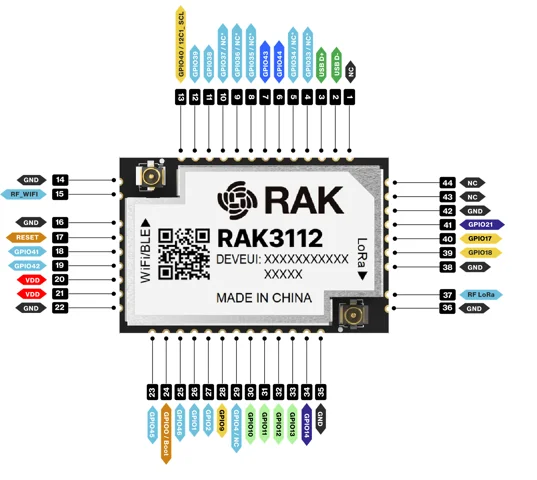

# RAK3112 LoRa Wi-Fi BLE module

**RAKwireless** · ESP32-S3

Revision: PCB revision not established

Coverage: Physical source pinout available; independent completeness review pending

[Browse all manufacturers](../../../../BROWSE.md) · [Devices & IoT](../../../../DEVICES.md) · [Open in the browser guide](https://valleytech-black-wire-guide.pages.dev/?board=rakwireless-rak3112)

## Datasheets and original documentation

Board datasheet: **recorded**. Visual reference: **available**.

[Original manufacturer / project documentation](https://docs.rakwireless.com/product-categories/wisduo/rak3112-module/datasheet/)

- **datasheet / board**: [RAK3112 LoRa Wi-Fi BLE module manufacturer HTML datasheet](https://docs.rakwireless.com/product-categories/wisduo/rak3112-module/datasheet/) · online

Source identity and visual scope reviewed. Pin assignments and electrical limits are not independently bench-verified. Match the exact PCB revision, connector view and populated options. Core-module castellations, WisConnector numbers and base-board GPIO labels use different numbering. The core-module table must not be used as a physical base-board map.

[Documentation coverage and remaining gaps](../../../../DOCUMENTATION.md)

## RAK3112 LoRa Wi-Fi BLE module — RAK3112 module pinout diagram

**pinout image** · Source visual inspected; independent electrical and all-pin completeness review pending · PNG

[Open original reference](../../../../library/media/ff424456e8fc5aebae40d97c089f5358f2c88232b27fe46331fed5c5013c8926.png)

**Credit and rights:** RAKwireless / original artwork contributors. Asset-specific redistribution and print rights are not established; Black Wire licenses do not relicense this source artwork.. Source/manufacturer: RAKwireless.

[Source 1](https://images.docs.rakwireless.com/wisduo/rak3112-module/datasheet/rak3112-pinout.png) · [Source 2](https://docs.rakwireless.com/product-categories/wisduo/rak3112-module/datasheet/)

Source identity and visual scope reviewed. Pin assignments and electrical limits are not independently bench-verified. Match the exact PCB revision, connector view and populated options. Core-module castellations, WisConnector numbers and base-board GPIO labels use different numbering. The core-module table must not be used as a physical base-board map.

Image revision: PCB revision not established

SHA-256: `ff424456e8fc5aebae40d97c089f5358f2c88232b27fe46331fed5c5013c8926`

Pin assignments have not been independently electrically verified. Check board revision before wiring.
