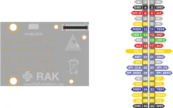

# RAK13002 WisBlock IO Module

**RAKwireless** · Expansion

Revision: See exact source revision

Coverage: Physical pinout source collected; check exact connector scope and revision

[Browse all manufacturers](../../../../BROWSE.md) · [Devices & IoT](../../../../DEVICES.md) · [Open in the browser guide](https://valleytech-black-wire-guide.pages.dev/?board=rakwireless-rak13002-wisblock-io-module)

## Datasheets and original documentation

Board datasheet: **recorded**. Visual reference: **available**.

[Original manufacturer hardware website](https://docs.rakwireless.com/product-categories/wisblock/rak13002/datasheet/)

- **datasheet / board**: [RAK13002 module datasheet](https://docs.rakwireless.com/product-categories/wisblock/rak13002/datasheet/) · online

Match the exact board, carrier and PCB revision. A component datasheet does not define the board header or input-power limits.

[Documentation coverage and remaining gaps](../../../../DOCUMENTATION.md)

## Specifications and hardware documentation

- [Manufacturer specifications & hardware guide](https://docs.rakwireless.com/product-categories/wisblock/rak13002/datasheet/)

## RAK13002 physical connector pinout (manufacturer SVG render)

**pinout image** · Reviewed source · PNG

[Open original reference](../../../../library/media/761224d782ec1a38515c1171d67336571973e42e9e8d3163a0cb2fbe8b90e89c.png)

[Original vector companion](../../../../library/media/2d016b08e5fc80e3e89e1db5775100f1ab08d8b170d40cb055e5b9e292f9e435.svg)

**Credit and rights:** RAKwireless / original reference contributors. Asset-specific redistribution and print rights have not been established. Original artwork is not relicensed by the Black Wire editorial license.. Source/manufacturer: RAKwireless.

[Source 1](https://images.docs.rakwireless.com/wisblock/rak13002/datasheet/rak13002_pinout.svg) · [Source 2](https://docs.rakwireless.com/product-categories/wisblock/rak13002/datasheet/)

Only the connectors and PCB revision shown are covered. Match physical orientation and electrical limits in the manufacturer hardware guide. Raster preview rendered from unchanged manufacturer SVG. The on-screen preview uses the original SVG to retain sharp labels when zoomed.

Image revision: See exact source revision

SHA-256: `761224d782ec1a38515c1171d67336571973e42e9e8d3163a0cb2fbe8b90e89c`

Pin assignments have not been independently electrically verified. Check board revision before wiring.
