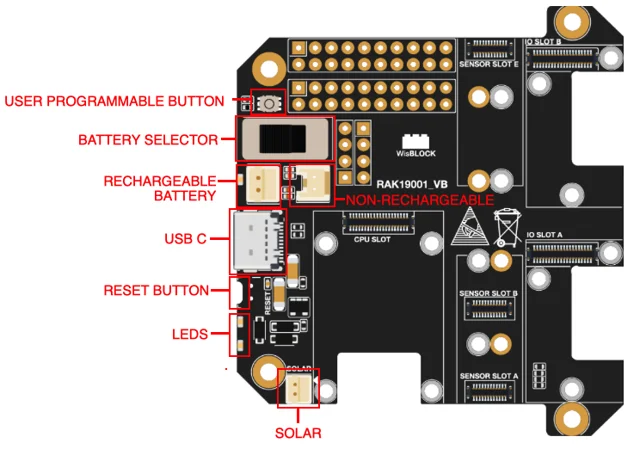

# RAK19001

**RAKwireless** · Expansion

Revision: Not identified

Coverage: Board labels only; pinout needed

[Browse all manufacturers](../../../../BROWSE.md) · [Devices & IoT](../../../../DEVICES.md) · [Open in the browser guide](https://valleytech-black-wire-guide.pages.dev/?board=rakwireless-expansion-rak19001)

## Datasheets and original documentation

Board datasheet: **not yet recorded**. Visual reference: **available**.

[Manufacturer source (recorded link)](https://docs.rakwireless.com/product-categories/wisblock/rak19001/datasheet/)

A chip datasheet, schematic and board datasheet have different scopes. Match the exact hardware revision.

[Documentation coverage and remaining gaps](../../../../DOCUMENTATION.md)

## RAK19001 part labels

**board labeling image** · Reviewed source · PNG

[Open original reference](../../../../library/media/606ccbf1c3e3591862309ae6abaad0bf26f03a3c2c386bc68afb832e567d02c2.png)

**Credit and rights:** Not established; source attribution retained. Source/manufacturer: RAKwireless.

[Source 1](https://raw.githubusercontent.com/RAKWireless/RAKwireless-docs/4361f2635b6e16c72a46167a208db87427106bef/docs/.vuepress/public/assets/images/wisblock/rak19001/datasheet/RAK19001-label.png) · [Source 2](https://docs.rakwireless.com/product-categories/wisblock/rak19001/datasheet/)

Image revision: Not identified

SHA-256: `606ccbf1c3e3591862309ae6abaad0bf26f03a3c2c386bc68afb832e567d02c2`

Pin assignments have not been independently electrically verified. Check board revision before wiring.
