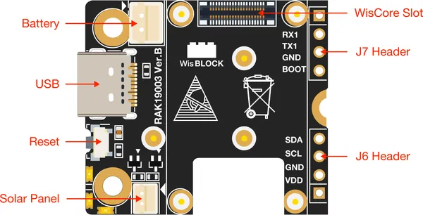

# RAK19003

**RAKwireless** · Expansion

Revision: Not identified  
Coverage: Partial pinout collected; full reference still needed

[Browse all manufacturers](../../../../BROWSE.md) · [Desktop app](https://github.com/valleytechsolutions/black-wire-desktop)

## RAK19003 Top View Components

**pinout image** · Reviewed source · PNG

[Open original reference](../../../../library/media/f7b9b28a6c10ae634758324e238ac0002f0795b89820091ff742d5ccc123951f.png) · [Original vector](../../../../library/media/cb6655ee70649cdbd26fca5866fb0f9ec4ee411d97cc1d83669834fb7d8a1410.svg)

**Credit and rights:** Not established; source attribution retained. Source/manufacturer: RAKwireless.

[Source 1](https://raw.githubusercontent.com/RAKWireless/RAKwireless-docs/4361f2635b6e16c72a46167a208db87427106bef/docs/.vuepress/public/assets/images/wisblock/rak19003/datasheet/rak19003-interface-1.svg) · [Source 2](https://docs.rakwireless.com/product-categories/wisblock/rak19003/datasheet/)

Raster rendering of the original manufacturer SVG at 240 DPI, fitted within 3000 pixels. Original vector retained. Labels have not been redrawn. Physical PCB/module pads or named board connector. Module entries are radio PCBs, not bare IC package pinouts. Check model suffix and radio band. Only the shown headers or battery connector are covered.

**Partial diagram. Confirm missing pins against the exact board documentation.**

SHA-256: `f7b9b28a6c10ae634758324e238ac0002f0795b89820091ff742d5ccc123951f`

Pin assignments have not been independently electrically verified. Check board revision before wiring.
