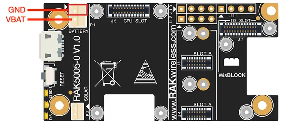

# RAK5005-O

**RAKwireless** · Expansion

Revision: Not identified

Coverage: Partial pinout collected; full reference still needed

[Browse all manufacturers](../../../../BROWSE.md) · [Devices & IoT](../../../../DEVICES.md) · [Open in the browser guide](https://valleytech-black-wire-guide.pages.dev/?board=rakwireless-expansion-rak5005-o)

## Datasheets and original documentation

Board datasheet: **not yet recorded**. Visual reference: **available**.

[Manufacturer source (recorded link)](https://docs.rakwireless.com/product-categories/wisblock/rak5005-o/datasheet/)

A chip datasheet, schematic and board datasheet have different scopes. Match the exact hardware revision.

[Documentation coverage and remaining gaps](../../../../DOCUMENTATION.md)

## Battery connector polarity

**pinout image** · Reviewed source · PNG

[Open original reference](../../../../library/media/ae1fd105257dbc181aedd24b92dbd4b141bf36fe8dd5c51059ab16e019ac810a.png)

**Credit and rights:** Not established; source attribution retained. Source/manufacturer: RAKwireless.

[Source 1](https://raw.githubusercontent.com/RAKWireless/RAKwireless-docs/4361f2635b6e16c72a46167a208db87427106bef/docs/.vuepress/public/assets/images/wisblock/rak5005-o/datasheet/RAK5005-O-battery.png) · [Source 2](https://docs.rakwireless.com/product-categories/wisblock/rak5005-o/datasheet/)

 Physical PCB/module pads or named board connector. Module entries are radio PCBs, not bare IC package pinouts. Check model suffix and radio band. Only the shown headers or battery connector are covered.

Image revision: Not identified

SHA-256: `ae1fd105257dbc181aedd24b92dbd4b141bf36fe8dd5c51059ab16e019ac810a`

Pin assignments have not been independently electrically verified. Check board revision before wiring.
