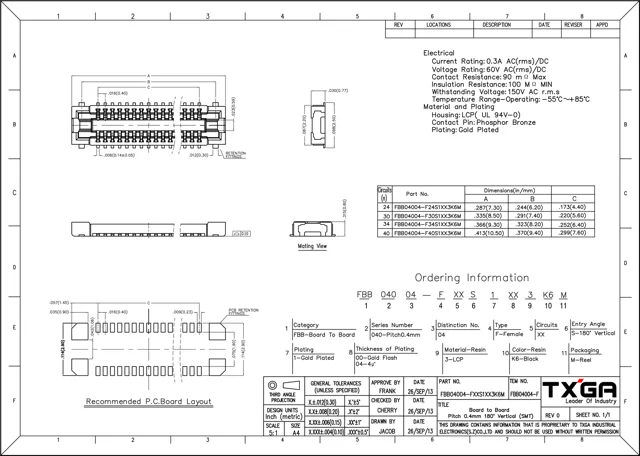
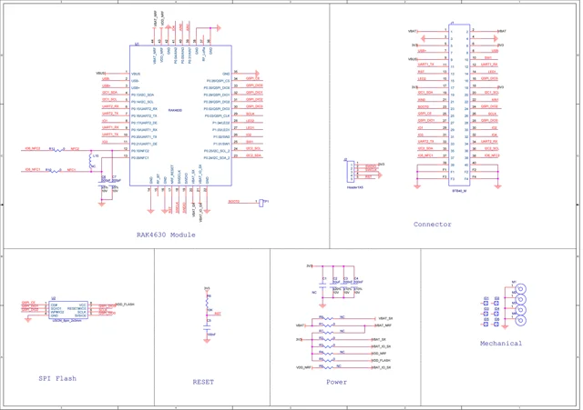
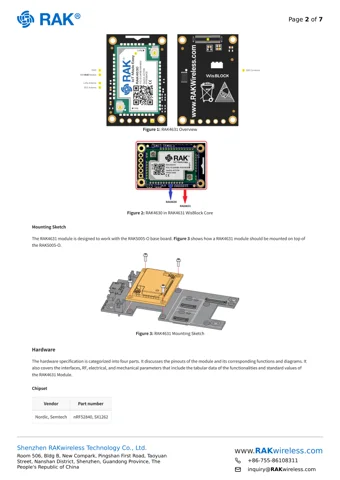

# RAK4631

**RAKwireless** · nRF52840

Revision: Not identified

Coverage: Supporting references; complete physical pinout still needed

[Browse all manufacturers](../../../../BROWSE.md) · [Devices & IoT](../../../../DEVICES.md) · [Open in the browser guide](https://valleytech-black-wire-guide.pages.dev/?board=rakwireless-other-rak4631)

## Datasheets and original documentation

Board datasheet: **recorded**. Visual reference: **available**.

[Original manufacturer / project documentation](https://docs.rakwireless.com/product-categories/wisblock/rak4631/datasheet/)

- **datasheet / board**: [RAK4631 manufacturer HTML datasheet](https://docs.rakwireless.com/product-categories/wisblock/rak4631/datasheet/) · online
- **datasheet / board**: [RAK4631 datasheet — publisher documentation mirrored by DigiKey](https://mm.digikey.com/Volume0/opasdata/d220001/medias/docus/6536/RAK4631.pdf) · [saved document](../../../../library/media/cd991325d0f9bb293ed02df56df7e1b2689447dfacbdbf01a49e6bc9a6e88c65.pdf)

Source identity and visual scope reviewed. Pin assignments and electrical limits are not independently bench-verified. Match the exact PCB revision, connector view and populated options. Core-module castellations, WisConnector numbers and base-board GPIO labels use different numbering. The core-module table must not be used as a physical base-board map.

[Documentation coverage and remaining gaps](../../../../DOCUMENTATION.md)

## RAK4631 — WisConnector PCB footprint and recommendations

**connector reference** · Source visual inspected; independent electrical and all-pin completeness review pending · PNG

[Open original reference](../../../../library/media/8b6db3a3da9d1d0dd7c291e2dc7c632239f6e5fca00442bae3cfb582135fd070.png)

**Credit and rights:** RAKwireless / original artwork contributors. Asset-specific redistribution and print rights are not established; Black Wire licenses do not relicense this source artwork.. Source/manufacturer: RAKwireless.

[Source 1](https://images.docs.rakwireless.com/wisblock/rak4631/datasheet/fxxs1003k6m.png) · [Source 2](https://docs.rakwireless.com/product-categories/wisblock/rak4631/datasheet/)

Source identity and visual scope reviewed. Pin assignments and electrical limits are not independently bench-verified. Match the exact PCB revision, connector view and populated options. Core-module castellations, WisConnector numbers and base-board GPIO labels use different numbering. The core-module table must not be used as a physical base-board map.

Image revision: Not identified

SHA-256: `8b6db3a3da9d1d0dd7c291e2dc7c632239f6e5fca00442bae3cfb582135fd070`

## RAK4631 — RAK4631 Schematic Diagram

**schematic image** · Source visual inspected; independent electrical and all-pin completeness review pending · PNG

[Open original reference](../../../../library/media/f94e34fd83abd73d15001ec22ab18580075c88e23cb0b5bcdcb919decd6ad0d8.png)

**Credit and rights:** RAKwireless / original artwork contributors. Asset-specific redistribution and print rights are not established; Black Wire licenses do not relicense this source artwork.. Source/manufacturer: RAKwireless.

[Source 1](https://images.docs.rakwireless.com/wisblock/rak4631/datasheet/schematic.png) · [Source 2](https://docs.rakwireless.com/product-categories/wisblock/rak4631/datasheet/)

Source identity and visual scope reviewed. Pin assignments and electrical limits are not independently bench-verified. Match the exact PCB revision, connector view and populated options. Core-module castellations, WisConnector numbers and base-board GPIO labels use different numbering. The core-module table must not be used as a physical base-board map.

Image revision: Not identified

SHA-256: `f94e34fd83abd73d15001ec22ab18580075c88e23cb0b5bcdcb919decd6ad0d8`

## RAK4631 datasheet — publisher documentation mirrored by DigiKey

**original reference PDF** · Source visual inspected; independent electrical and all-pin completeness review pending · PDF

[Open original reference](../../../../library/media/cd991325d0f9bb293ed02df56df7e1b2689447dfacbdbf01a49e6bc9a6e88c65.pdf)

**Credit and rights:** RAKwireless / original artwork contributors. Asset-specific redistribution and print rights are not established; Black Wire licenses do not relicense this source artwork.. Source/manufacturer: RAKwireless.

[Source 1](https://mm.digikey.com/Volume0/opasdata/d220001/medias/docus/6536/RAK4631.pdf) · [Source 2](https://docs.rakwireless.com/product-categories/wisblock/rak4631/datasheet/)

Source identity and visual scope reviewed. Pin assignments and electrical limits are not independently bench-verified. Match the exact PCB revision, connector view and populated options. Core-module castellations, WisConnector numbers and base-board GPIO labels use different numbering. The core-module table must not be used as a physical base-board map.

Image revision: Not identified

SHA-256: `cd991325d0f9bb293ed02df56df7e1b2689447dfacbdbf01a49e6bc9a6e88c65`

## RAK4631 — module identification and mounting, original datasheet page 2

**board labeling image** · Source visual inspected; independent electrical and all-pin completeness review pending · PNG

[Open original reference](../../../../library/media/8630bd48da3a129cd505f3b4b2b02ed2b4c7acb50d0d731ccf95d5a20b01151c.png)

**Credit and rights:** RAKwireless / original artwork contributors. Asset-specific redistribution and print rights are not established; Black Wire licenses do not relicense this source artwork.. Source/manufacturer: RAKwireless.

[Source 1](https://mm.digikey.com/Volume0/opasdata/d220001/medias/docus/6536/RAK4631.pdf) · [Source 2](https://docs.rakwireless.com/product-categories/wisblock/rak4631/datasheet/)

Source identity and visual scope reviewed. Pin assignments and electrical limits are not independently bench-verified. Match the exact PCB revision, connector view and populated options. Core-module castellations, WisConnector numbers and base-board GPIO labels use different numbering. The core-module table must not be used as a physical base-board map.

Image revision: Not identified

SHA-256: `8630bd48da3a129cd505f3b4b2b02ed2b4c7acb50d0d731ccf95d5a20b01151c`

Pin assignments have not been independently electrically verified. Check board revision before wiring.
