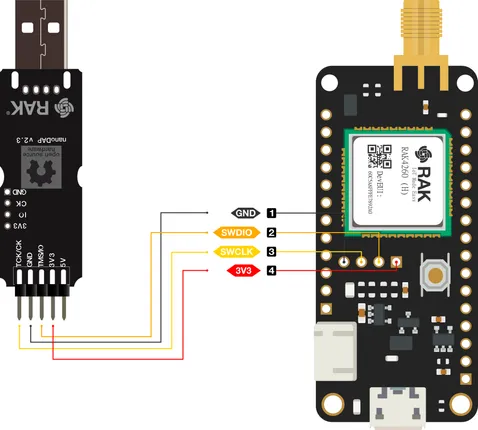
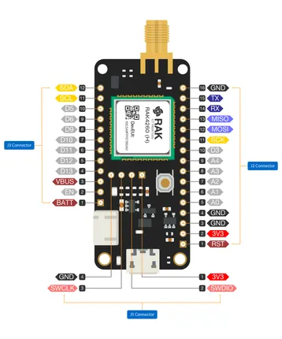
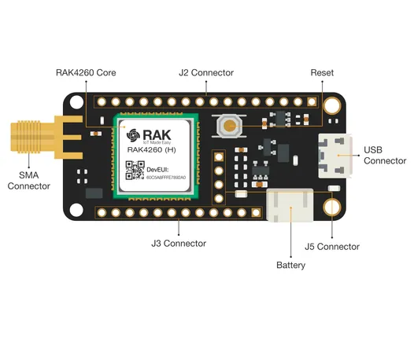

# BastWAN

**RAKwireless** · Other

Revision: Not identified  
Coverage: Pinout image collected

[Browse all manufacturers](../../../../BROWSE.md) · [Desktop app](https://github.com/valleytechsolutions/black-wire-desktop)

## RAK3244 BastWAN Breakout Board Pinout for DapLink tool

**pinout image** · Reviewed source · PNG

[Open original reference](../../../../library/media/6426cb50e21a40c95516761a7efd2334369fc83ee286c3461cccecd6c896c551.png) · [Original vector](../../../../library/media/8ec83d140c0e86552f57638fe33219165d77cf60f5ccda4c5adac296d0862f16.svg)

**Credit and rights:** Not established; source attribution retained. Source/manufacturer: RAKwireless.

[Source 1](https://raw.githubusercontent.com/RAKWireless/RAKwireless-docs/4361f2635b6e16c72a46167a208db87427106bef/docs/.vuepress/public/assets/images/wisduo/bastwan/datasheet/rak3244_daplink.svg) · [Source 2](https://docs.rakwireless.com/product-categories/wisduo/bastwan/datasheet/)

Raster rendering of the original manufacturer SVG at 240 DPI, fitted within 3000 pixels. Original vector retained. Labels have not been redrawn. Physical PCB/module pads or named board connector. Module entries are radio PCBs, not bare IC package pinouts. Check model suffix and radio band.

**Partial diagram. Confirm missing pins against the exact board documentation.**

SHA-256: `6426cb50e21a40c95516761a7efd2334369fc83ee286c3461cccecd6c896c551`

## RAK3244 BastWAN Breakout Board Pinout

**pinout image** · Reviewed source · PNG

[Open original reference](../../../../library/media/cc3b829265d2c1a5ed6cef0175954c6634b656d8b88f5814a10809084a5e6087.png) · [Original vector](../../../../library/media/b740b028f0d04ffbc19691d5e0a0f025f79afdb3607115e86642c7ff4ee88809.svg)

**Credit and rights:** Not established; source attribution retained. Source/manufacturer: RAKwireless.

[Source 1](https://raw.githubusercontent.com/RAKWireless/RAKwireless-docs/4361f2635b6e16c72a46167a208db87427106bef/docs/.vuepress/public/assets/images/wisduo/bastwan/datasheet/rak3244-pinout.svg) · [Source 2](https://docs.rakwireless.com/product-categories/wisduo/bastwan/datasheet/)

Raster rendering of the original manufacturer SVG at 240 DPI, fitted within 3000 pixels. Original vector retained. Labels have not been redrawn. Physical PCB/module pads or named board connector. Module entries are radio PCBs, not bare IC package pinouts. Check model suffix and radio band.

SHA-256: `cc3b829265d2c1a5ed6cef0175954c6634b656d8b88f5814a10809084a5e6087`

## RAK3244 BastWAN Breakout Board Interface Overview

**board labeling image** · Reviewed source · PNG

[Open original reference](../../../../library/media/694146acd6f7990401652f5aee38970118e58b53cb5318f32def20241cd77665.png) · [Original vector](../../../../library/media/884e8d23726eff316591027ed93a635ae53f329b1e2d6bdacc8737b388bf03f7.svg)

**Credit and rights:** Not established; source attribution retained. Source/manufacturer: RAKwireless.

[Source 1](https://raw.githubusercontent.com/RAKWireless/RAKwireless-docs/4361f2635b6e16c72a46167a208db87427106bef/docs/.vuepress/public/assets/images/wisduo/bastwan/datasheet/rak3244-interface.svg) · [Source 2](https://docs.rakwireless.com/product-categories/wisduo/bastwan/datasheet/)

Raster rendering of the original manufacturer SVG at 240 DPI, fitted within 3000 pixels. Original vector retained. Labels have not been redrawn.

SHA-256: `694146acd6f7990401652f5aee38970118e58b53cb5318f32def20241cd77665`

Pin assignments have not been independently electrically verified. Check board revision before wiring.
