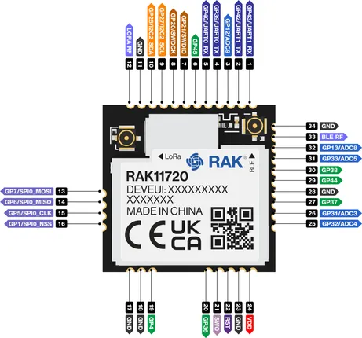

# RAK11720-Module

**RAKwireless** · Other

Revision: Not identified  
Coverage: Pinout image collected

[Browse all manufacturers](../../../../BROWSE.md) · [Desktop app](https://github.com/valleytechsolutions/black-wire-desktop)

## RAK11720 Pin Illustration

**pinout image** · Reviewed source · PNG

[Open original reference](../../../../library/media/193f2caf31a982c28bea2fe76cae75855a0bea6f434563ae7f00b4644704b086.png) · [Original vector](../../../../library/media/bce5512db5e003cf5abb19c025fc7f1c8c76df3de753ffd81b6cbf3f2621dae8.svg)

**Credit and rights:** Not established; source attribution retained. Source/manufacturer: RAKwireless.

[Source 1](https://raw.githubusercontent.com/RAKWireless/RAKwireless-docs/4361f2635b6e16c72a46167a208db87427106bef/docs/.vuepress/public/assets/images/wisduo/rak11720-module/datasheet/RAK11720-Pinout diagram.svg) · [Source 2](https://docs.rakwireless.com/product-categories/wisduo/rak11720-module/datasheet/)

Raster rendering of the original manufacturer SVG at 240 DPI, fitted within 3000 pixels. Original vector retained. Labels have not been redrawn. Physical PCB/module pads or named board connector. Module entries are radio PCBs, not bare IC package pinouts. Check model suffix and radio band.

SHA-256: `193f2caf31a982c28bea2fe76cae75855a0bea6f434563ae7f00b4644704b086`

Pin assignments have not been independently electrically verified. Check board revision before wiring.
