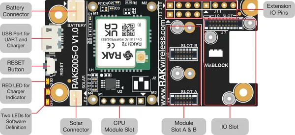

# RAK3172-Evaluation-Board

**RAKwireless** · Other

Revision: Not identified  
Coverage: Board labels only; pinout needed

[Browse all manufacturers](../../../../BROWSE.md) · [Desktop app](https://github.com/valleytechsolutions/black-wire-desktop)

## RAK3172 Evaluation Board Interfaces

**board labeling image** · Reviewed source · PNG

[Open original reference](../../../../library/media/053bdab0362f636ee8fae0f22c839afe5a50dc6dcac4d0f56486eafbc3bef3b4.png) · [Original vector](../../../../library/media/bf3607584b99664a8cc47b46d1a6b788e7d915e3ce4e44e2ed119860e355ecdd.svg)

**Credit and rights:** Not established; source attribution retained. Source/manufacturer: RAKwireless.

[Source 1](https://raw.githubusercontent.com/RAKWireless/RAKwireless-docs/4361f2635b6e16c72a46167a208db87427106bef/docs/.vuepress/public/assets/images/wisduo/rak3172-evaluation-board/datasheet/interfaces/RAK3172E-Interface.svg) · [Source 2](https://docs.rakwireless.com/product-categories/wisduo/rak3172-evaluation-board/datasheet/)

Raster rendering of the original manufacturer SVG at 240 DPI, fitted within 3000 pixels. Original vector retained. Labels have not been redrawn.

SHA-256: `053bdab0362f636ee8fae0f22c839afe5a50dc6dcac4d0f56486eafbc3bef3b4`

Pin assignments have not been independently electrically verified. Check board revision before wiring.
