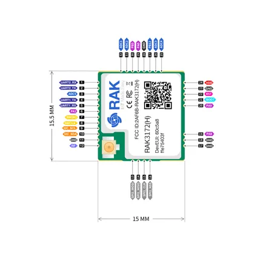

# RAK3172-Module

**RAKwireless** · Other

Revision: Not identified  
Coverage: Pinout image collected

[Browse all manufacturers](../../../../BROWSE.md) · [Desktop app](https://github.com/valleytechsolutions/black-wire-desktop)

## Board Pinout for RAK3172

**pinout image** · Reviewed source · JPG

[Open original reference](../../../../library/media/82d4c824f71da1d64824399ff3d0508dbcad26e7a7f1e89b71b028990477cc40.jpg)

**Credit and rights:** Not established; source attribution retained. Source/manufacturer: RAKwireless.

[Source 1](https://raw.githubusercontent.com/RAKWireless/RAKwireless-docs/4361f2635b6e16c72a46167a208db87427106bef/docs/.vuepress/public/assets/images/wisduo/rak3172-module/datasheet/pin-definition/rak3172_pin.jpg) · [Source 2](https://docs.rakwireless.com/product-categories/wisduo/rak3172-module/datasheet/)

 Physical PCB/module pads or named board connector. Module entries are radio PCBs, not bare IC package pinouts. Check model suffix and radio band.

SHA-256: `82d4c824f71da1d64824399ff3d0508dbcad26e7a7f1e89b71b028990477cc40`

Pin assignments have not been independently electrically verified. Check board revision before wiring.
