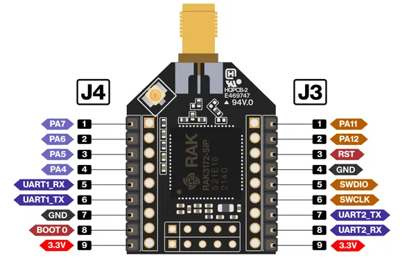
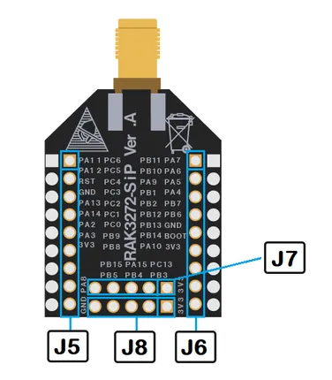

# RAK3272-SiP-Breakout-Board

**RAKwireless** · Other

Revision: Not identified  
Coverage: Pinout image collected

[Browse all manufacturers](../../../../BROWSE.md) · [Desktop app](https://github.com/valleytechsolutions/black-wire-desktop)

## RAK3272-SiP Breakout Board J3 and J4 header

**pinout image** · Reviewed source · PNG

[Open original reference](../../../../library/media/5cf851f00f1b8c93f73b3c568e11d4072476786bb51d8200a3b8240e073d43a5.png)

**Credit and rights:** Not established; source attribution retained. Source/manufacturer: RAKwireless.

[Source 1](https://raw.githubusercontent.com/RAKWireless/RAKwireless-docs/4361f2635b6e16c72a46167a208db87427106bef/docs/.vuepress/public/assets/images/wisduo/rak3272-sip-breakout-board/datasheet/rak3272-sip-pinout.png) · [Source 2](https://docs.rakwireless.com/product-categories/wisduo/rak3272-sip-breakout-board/datasheet/)

 Physical PCB/module pads or named board connector. Module entries are radio PCBs, not bare IC package pinouts. Check model suffix and radio band.

SHA-256: `5cf851f00f1b8c93f73b3c568e11d4072476786bb51d8200a3b8240e073d43a5`

## RAK3272-SiP Breakout Board J5 to J8 header

**pinout image** · Reviewed source · PNG

[Open original reference](../../../../library/media/2602f4f6e285a0030654cd1672205816b3b48263c52b6156b5bad7e8a801dc91.png)

**Credit and rights:** Not established; source attribution retained. Source/manufacturer: RAKwireless.

[Source 1](https://raw.githubusercontent.com/RAKWireless/RAKwireless-docs/4361f2635b6e16c72a46167a208db87427106bef/docs/.vuepress/public/assets/images/wisduo/rak3272-sip-breakout-board/datasheet/rak3272-sip-pinout-back.png) · [Source 2](https://docs.rakwireless.com/product-categories/wisduo/rak3272-sip-breakout-board/datasheet/)

 Physical PCB/module pads or named board connector. Module entries are radio PCBs, not bare IC package pinouts. Check model suffix and radio band.

SHA-256: `2602f4f6e285a0030654cd1672205816b3b48263c52b6156b5bad7e8a801dc91`

Pin assignments have not been independently electrically verified. Check board revision before wiring.
