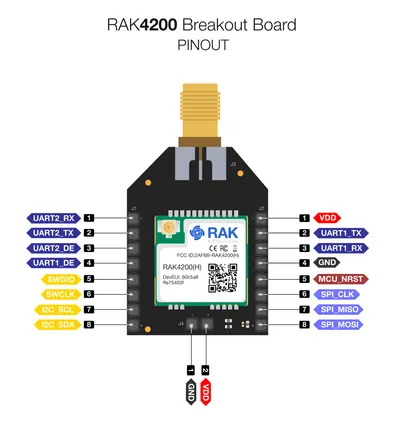

# RAK4200-Breakout-Board

**RAKwireless** · Other

Revision: Not identified  
Coverage: Pinout image collected

[Browse all manufacturers](../../../../BROWSE.md) · [Desktop app](https://github.com/valleytechsolutions/black-wire-desktop)

## RAK4200 Breakout Board Pinout

**pinout image** · Reviewed source · PNG

[Open original reference](../../../../library/media/875d2f91024162526fb0409ff48fd7e598b311b3327b14ca94f6ed0d132549f7.png) · [Original vector](../../../../library/media/30edae3b33b7b7332e302735ef47acbe1b3595147046748d38ae4cd7574fbf49.svg)

**Credit and rights:** Not established; source attribution retained. Source/manufacturer: RAKwireless.

[Source 1](https://raw.githubusercontent.com/RAKWireless/RAKwireless-docs/4361f2635b6e16c72a46167a208db87427106bef/docs/.vuepress/public/assets/images/wisduo/rak4200-breakout-board/datasheet/rak4200-breakout-board-pinout.svg) · [Source 2](https://docs.rakwireless.com/product-categories/wisduo/rak4200-breakout-board/datasheet/)

Raster rendering of the original manufacturer SVG at 240 DPI, fitted within 3000 pixels. Original vector retained. Labels have not been redrawn. Physical PCB/module pads or named board connector. Module entries are radio PCBs, not bare IC package pinouts. Check model suffix and radio band.

SHA-256: `875d2f91024162526fb0409ff48fd7e598b311b3327b14ca94f6ed0d132549f7`

Pin assignments have not been independently electrically verified. Check board revision before wiring.
