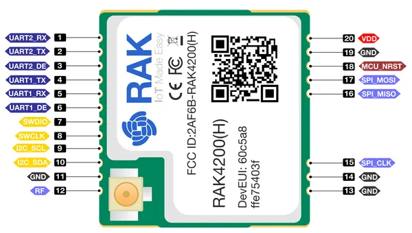

# RAK4200-Module

**RAKwireless** · Other

Revision: Not identified  
Coverage: Pinout image collected

[Browse all manufacturers](../../../../BROWSE.md) · [Desktop app](https://github.com/valleytechsolutions/black-wire-desktop)

## Pinout for RAK4200

**pinout image** · Reviewed source · PNG

[Open original reference](../../../../library/media/4b7433edf93b470a9d97b486da2322df910747d8e13eafb5bad65acaa15b5e5a.png) · [Original vector](../../../../library/media/3528a77483e71e78bd59709b0e86456dc9dbb645a58886ba5bbdc6d583ac5aaa.svg)

**Credit and rights:** Not established; source attribution retained. Source/manufacturer: RAKwireless.

[Source 1](https://raw.githubusercontent.com/RAKWireless/RAKwireless-docs/4361f2635b6e16c72a46167a208db87427106bef/docs/.vuepress/public/assets/images/wisduo/rak4200-module/datasheet/pinout-for-rak4200.svg) · [Source 2](https://docs.rakwireless.com/product-categories/wisduo/rak4200-module/datasheet/)

Raster rendering of the original manufacturer SVG at 240 DPI, fitted within 3000 pixels. Original vector retained. Labels have not been redrawn. Physical PCB/module pads or named board connector. Module entries are radio PCBs, not bare IC package pinouts. Check model suffix and radio band.

SHA-256: `4b7433edf93b470a9d97b486da2322df910747d8e13eafb5bad65acaa15b5e5a`

Pin assignments have not been independently electrically verified. Check board revision before wiring.
