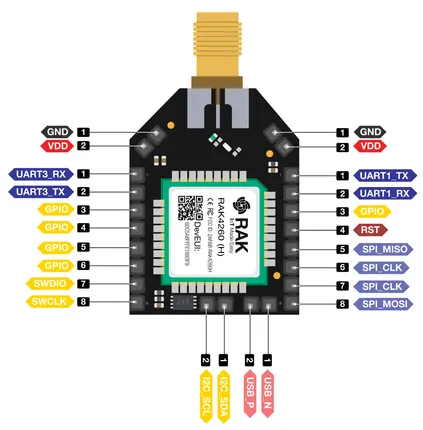

# RAK4260-Breakout-Board

**RAKwireless** · Other

Revision: Not identified  
Coverage: Pinout image collected

[Browse all manufacturers](../../../../BROWSE.md) · [Desktop app](https://github.com/valleytechsolutions/black-wire-desktop)

## RAK4260 Breakout Board Pinout

**pinout image** · Reviewed source · PNG

[Open original reference](../../../../library/media/59fb8566c308a9751ead52baa26c2019a4ffa50ab6dbd66368fc09b8b924036f.png) · [Original vector](../../../../library/media/f64c2b675453ba139c0263af41865a5599d91f37aebbf741359e08a9dbb199fa.svg)

**Credit and rights:** Not established; source attribution retained. Source/manufacturer: RAKwireless.

[Source 1](https://raw.githubusercontent.com/RAKWireless/RAKwireless-docs/4361f2635b6e16c72a46167a208db87427106bef/docs/.vuepress/public/assets/images/wisduo/rak4260-breakout-board/datasheet/pinout.svg) · [Source 2](https://docs.rakwireless.com/product-categories/wisduo/rak4260-breakout-board/datasheet/)

Raster rendering of the original manufacturer SVG at 240 DPI, fitted within 3000 pixels. Original vector retained. Labels have not been redrawn. Physical PCB/module pads or named board connector. Module entries are radio PCBs, not bare IC package pinouts. Check model suffix and radio band.

SHA-256: `59fb8566c308a9751ead52baa26c2019a4ffa50ab6dbd66368fc09b8b924036f`

Pin assignments have not been independently electrically verified. Check board revision before wiring.
