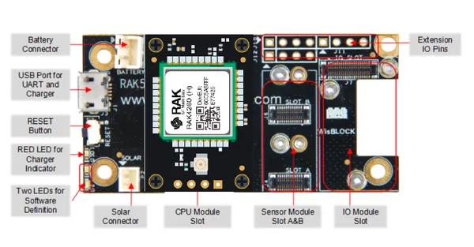

# RAK4260-Evaluation-Board

**RAKwireless** · Other

Revision: Not identified  
Coverage: Board labels only; pinout needed

[Browse all manufacturers](../../../../BROWSE.md) · [Desktop app](https://github.com/valleytechsolutions/black-wire-desktop)

## RAK4260 Evaluation Board Interface Overview

**board labeling image** · Reviewed source · PNG

[Open original reference](../../../../library/media/ba5b4c1a102a143e1086a7c7a317313a777b18bebf2ae446cafc050e1b8771cc.png)

**Credit and rights:** Not established; source attribution retained. Source/manufacturer: RAKwireless.

[Source 1](https://raw.githubusercontent.com/RAKWireless/RAKwireless-docs/4361f2635b6e16c72a46167a208db87427106bef/docs/.vuepress/public/assets/images/wisduo/rak4260-evaluation-board/datasheet/rak4260-interfaces.png) · [Source 2](https://docs.rakwireless.com/product-categories/wisduo/rak4260-evaluation-board/datasheet/)

SHA-256: `ba5b4c1a102a143e1086a7c7a317313a777b18bebf2ae446cafc050e1b8771cc`

Pin assignments have not been independently electrically verified. Check board revision before wiring.
