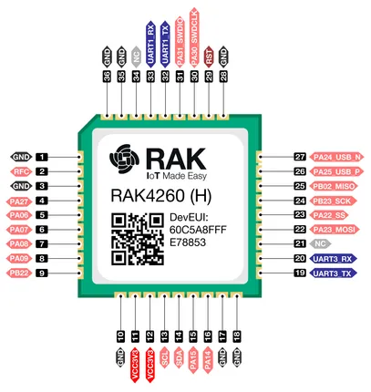

# RAK4260-Module

**RAKwireless** · Other

Revision: Not identified  
Coverage: Pinout image collected

[Browse all manufacturers](../../../../BROWSE.md) · [Desktop app](https://github.com/valleytechsolutions/black-wire-desktop)

## RAK4260 Board Pinout

**pinout image** · Reviewed source · PNG

[Open original reference](../../../../library/media/ac58fb265d50170ca474ce01fda2bf558a0c8efdbe488edb574370592deecffc.png) · [Original vector](../../../../library/media/1b4d71f824f4f50e3e6dd63405cf221f5f0736a1e8f8ed097bd7c819dcddfc5e.svg)

**Credit and rights:** Not established; source attribution retained. Source/manufacturer: RAKwireless.

[Source 1](https://raw.githubusercontent.com/RAKWireless/RAKwireless-docs/4361f2635b6e16c72a46167a208db87427106bef/docs/.vuepress/public/assets/images/wisduo/rak4260-module/datasheet/rak4260-board-pinout.svg) · [Source 2](https://docs.rakwireless.com/product-categories/wisduo/rak4260-module/datasheet/)

Raster rendering of the original manufacturer SVG at 240 DPI, fitted within 3000 pixels. Original vector retained. Labels have not been redrawn. Physical PCB/module pads or named board connector. Module entries are radio PCBs, not bare IC package pinouts. Check model suffix and radio band.

SHA-256: `ac58fb265d50170ca474ce01fda2bf558a0c8efdbe488edb574370592deecffc`

Pin assignments have not been independently electrically verified. Check board revision before wiring.
