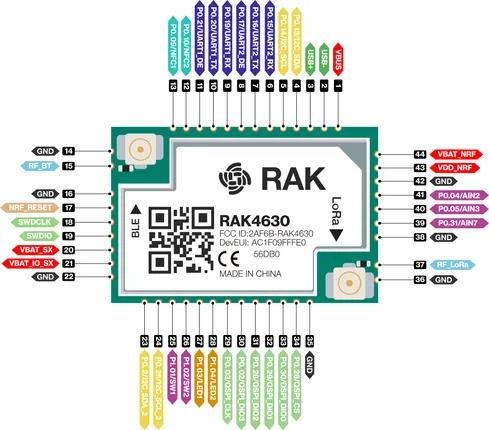

# RAK4630-Module

**RAKwireless** · Other

Revision: Not identified

Coverage: Pinout image collected

[Browse all manufacturers](../../../../BROWSE.md) · [Devices & IoT](../../../../DEVICES.md) · [Open in the browser guide](https://valleytech-black-wire-guide.pages.dev/?board=rakwireless-other-rak4630-module)

## Datasheets and original documentation

Board datasheet: **not yet recorded**. Visual reference: **available**.

[Manufacturer source (recorded link)](https://docs.rakwireless.com/product-categories/wisduo/rak4630-module/datasheet/)

A chip datasheet, schematic and board datasheet have different scopes. Match the exact hardware revision.

[Documentation coverage and remaining gaps](../../../../DOCUMENTATION.md)

## RAK4630 module pinout diagram

**pinout image** · Reviewed source · PNG

[Open original reference](../../../../library/media/70d8433b1cbab5201159dbf063d96b9db062bb4944f9025158396615ba4ae24a.png)

[Original vector companion](../../../../library/media/96ac33a688e6b91366c57d0d536442f07714308f5bc33ee60615f7d3ffffcfda.svg)

**Credit and rights:** Not established; source attribution retained. Source/manufacturer: RAKwireless.

[Source 1](https://raw.githubusercontent.com/RAKWireless/RAKwireless-docs/4361f2635b6e16c72a46167a208db87427106bef/docs/.vuepress/public/assets/images/wisduo/rak4630-module/datasheet/RAK4630_Pinout.svg) · [Source 2](https://docs.rakwireless.com/product-categories/wisduo/rak4630-module/datasheet/)

Raster rendering of the original manufacturer SVG at 240 DPI, fitted within 3000 pixels. Original vector retained. Labels have not been redrawn. Physical PCB/module pads or named board connector. Module entries are radio PCBs, not bare IC package pinouts. Check model suffix and radio band.

Image revision: Not identified

SHA-256: `70d8433b1cbab5201159dbf063d96b9db062bb4944f9025158396615ba4ae24a`

Pin assignments have not been independently electrically verified. Check board revision before wiring.
