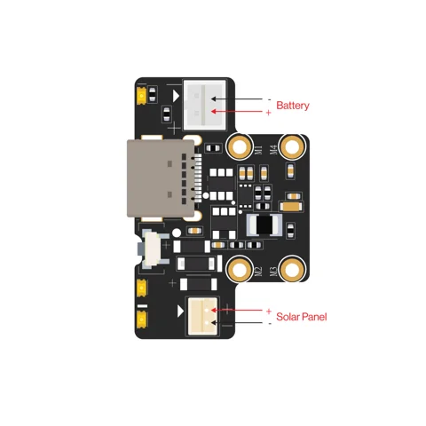
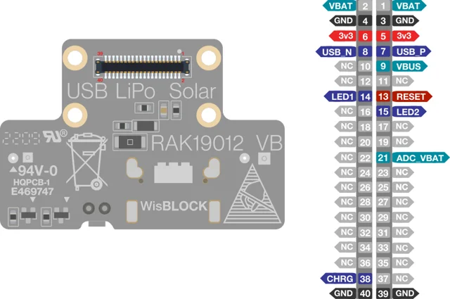

# RAK19012 USB LiPo Solar Power Module

**RAKwireless** · Power module

Revision: PCB revision not established

Coverage: Physical source pinout available; independent completeness review pending

[Browse all manufacturers](../../../../BROWSE.md) · [Devices & IoT](../../../../DEVICES.md) · [Open in the browser guide](https://valleytech-black-wire-guide.pages.dev/?board=rakwireless-rak19012)

## Datasheets and original documentation

Board datasheet: **recorded**. Visual reference: **available**.

[Original manufacturer / project documentation](https://docs.rakwireless.com/product-categories/wisblock/rak19012/datasheet/)

- **datasheet / board**: [RAK19012 USB LiPo Solar Power Module manufacturer HTML datasheet](https://docs.rakwireless.com/product-categories/wisblock/rak19012/datasheet/) · online

Source identity and visual scope reviewed. Pin assignments and electrical limits are not independently bench-verified. Match the exact PCB revision, connector view and populated options. Core-module castellations, WisConnector numbers and base-board GPIO labels use different numbering. The core-module table must not be used as a physical base-board map.

[Documentation coverage and remaining gaps](../../../../DOCUMENTATION.md)

## RAK19012 USB LiPo Solar Power Module — Battery and solar panel connector polarity

**board labeling image** · Source visual inspected; independent electrical and all-pin completeness review pending · SVG

[Open original reference](../../../../library/media/435cf92ec5e6d2b776f8ca7c87de15586fe0180b3706919492254f2f1ddbd824.svg)

**Credit and rights:** RAKwireless / original artwork contributors. Asset-specific redistribution and print rights are not established; Black Wire licenses do not relicense this source artwork.. Source/manufacturer: RAKwireless.

[Source 1](https://images.docs.rakwireless.com/wisblock/rak19012/quickstart/rak19012-battery-solar.svg) · [Source 2](https://docs.rakwireless.com/product-categories/wisblock/rak19012/datasheet/)

Source identity and visual scope reviewed. Pin assignments and electrical limits are not independently bench-verified. Match the exact PCB revision, connector view and populated options. Core-module castellations, WisConnector numbers and base-board GPIO labels use different numbering. The core-module table must not be used as a physical base-board map.

Image revision: PCB revision not established

SHA-256: `435cf92ec5e6d2b776f8ca7c87de15586fe0180b3706919492254f2f1ddbd824`

## RAK19012 USB LiPo Solar Power Module — RAK19012 pinout diagram

**pinout image** · Source visual inspected; independent electrical and all-pin completeness review pending · SVG

[Open original reference](../../../../library/media/063fd36f683638b81b4a2050ffcf9d5cd101fc3e8b76dad1a41f055a92ed0bd6.svg)

**Credit and rights:** RAKwireless / original artwork contributors. Asset-specific redistribution and print rights are not established; Black Wire licenses do not relicense this source artwork.. Source/manufacturer: RAKwireless.

[Source 1](https://images.docs.rakwireless.com/wisblock/rak19012/datasheet/rak19012-pinout.svg) · [Source 2](https://docs.rakwireless.com/product-categories/wisblock/rak19012/datasheet/)

Source identity and visual scope reviewed. Pin assignments and electrical limits are not independently bench-verified. Match the exact PCB revision, connector view and populated options. Core-module castellations, WisConnector numbers and base-board GPIO labels use different numbering. The core-module table must not be used as a physical base-board map.

Image revision: PCB revision not established

SHA-256: `063fd36f683638b81b4a2050ffcf9d5cd101fc3e8b76dad1a41f055a92ed0bd6`

Pin assignments have not been independently electrically verified. Check board revision before wiring.
