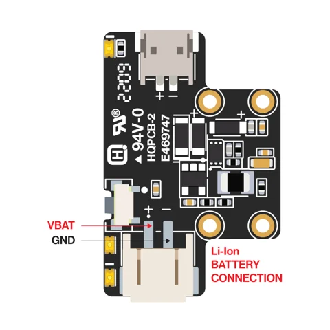
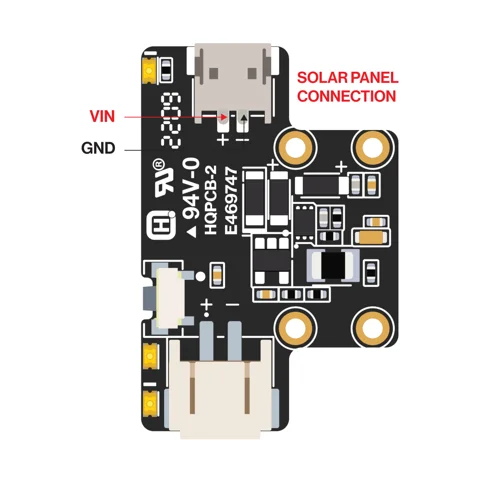
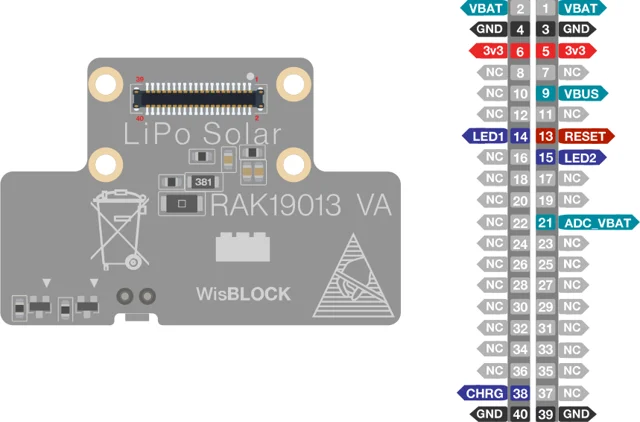

# RAK19013 LiPo Solar Power Module

**RAKwireless** · Power module

Revision: PCB revision not established

Coverage: Physical source pinout available; independent completeness review pending

[Browse all manufacturers](../../../../BROWSE.md) · [Devices & IoT](../../../../DEVICES.md) · [Open in the browser guide](https://valleytech-black-wire-guide.pages.dev/?board=rakwireless-rak19013)

## Datasheets and original documentation

Board datasheet: **recorded**. Visual reference: **available**.

[Original manufacturer / project documentation](https://docs.rakwireless.com/product-categories/wisblock/rak19013/datasheet/)

- **datasheet / board**: [RAK19013 LiPo Solar Power Module manufacturer HTML datasheet](https://docs.rakwireless.com/product-categories/wisblock/rak19013/datasheet/) · online

Source identity and visual scope reviewed. Pin assignments and electrical limits are not independently bench-verified. Match the exact PCB revision, connector view and populated options. Core-module castellations, WisConnector numbers and base-board GPIO labels use different numbering. The core-module table must not be used as a physical base-board map.

[Documentation coverage and remaining gaps](../../../../DOCUMENTATION.md)

## RAK19013 LiPo Solar Power Module — Battery connector pin order

**pinout image** · Source visual inspected; independent electrical and all-pin completeness review pending · SVG

[Open original reference](../../../../library/media/5ce13f61be86d65296c24e8c0b8c1b375366b084e9f3c757d7b09c070b1a41cf.svg)

**Credit and rights:** RAKwireless / original artwork contributors. Asset-specific redistribution and print rights are not established; Black Wire licenses do not relicense this source artwork.. Source/manufacturer: RAKwireless.

[Source 1](https://images.docs.rakwireless.com/wisblock/rak19013/datasheet/rak19013-battery-connection.svg) · [Source 2](https://docs.rakwireless.com/product-categories/wisblock/rak19013/datasheet/)

Source identity and visual scope reviewed. Pin assignments and electrical limits are not independently bench-verified. Match the exact PCB revision, connector view and populated options. Core-module castellations, WisConnector numbers and base-board GPIO labels use different numbering. The core-module table must not be used as a physical base-board map.

Image revision: PCB revision not established

SHA-256: `5ce13f61be86d65296c24e8c0b8c1b375366b084e9f3c757d7b09c070b1a41cf`

## RAK19013 LiPo Solar Power Module — Battery connector pin order

**pinout image** · Source visual inspected; independent electrical and all-pin completeness review pending · SVG

[Open original reference](../../../../library/media/0b6367f80a60e27b4620d04eab7e8c1af57debdadd83512fd5ae0b461577e791.svg)

**Credit and rights:** RAKwireless / original artwork contributors. Asset-specific redistribution and print rights are not established; Black Wire licenses do not relicense this source artwork.. Source/manufacturer: RAKwireless.

[Source 1](https://images.docs.rakwireless.com/wisblock/rak19013/datasheet/rak19013-solar-connection.svg) · [Source 2](https://docs.rakwireless.com/product-categories/wisblock/rak19013/datasheet/)

Source identity and visual scope reviewed. Pin assignments and electrical limits are not independently bench-verified. Match the exact PCB revision, connector view and populated options. Core-module castellations, WisConnector numbers and base-board GPIO labels use different numbering. The core-module table must not be used as a physical base-board map.

Image revision: PCB revision not established

SHA-256: `0b6367f80a60e27b4620d04eab7e8c1af57debdadd83512fd5ae0b461577e791`

## RAK19013 LiPo Solar Power Module — RAK19013 pinout diagram

**pinout image** · Source visual inspected; independent electrical and all-pin completeness review pending · SVG

[Open original reference](../../../../library/media/5eda3d38ba0eb5881d11a5e85c98c5766a77a47b816ab8c48c26635f11a8101c.svg)

**Credit and rights:** RAKwireless / original artwork contributors. Asset-specific redistribution and print rights are not established; Black Wire licenses do not relicense this source artwork.. Source/manufacturer: RAKwireless.

[Source 1](https://images.docs.rakwireless.com/wisblock/rak19013/datasheet/rak19013-pinout.svg) · [Source 2](https://docs.rakwireless.com/product-categories/wisblock/rak19013/datasheet/)

Source identity and visual scope reviewed. Pin assignments and electrical limits are not independently bench-verified. Match the exact PCB revision, connector view and populated options. Core-module castellations, WisConnector numbers and base-board GPIO labels use different numbering. The core-module table must not be used as a physical base-board map.

Image revision: PCB revision not established

SHA-256: `5eda3d38ba0eb5881d11a5e85c98c5766a77a47b816ab8c48c26635f11a8101c`

Pin assignments have not been independently electrically verified. Check board revision before wiring.
