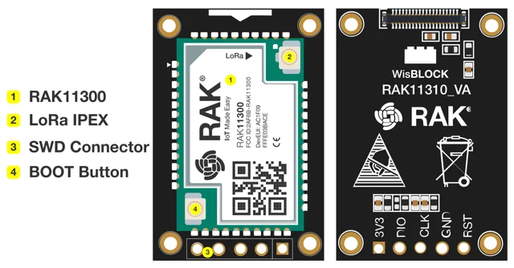
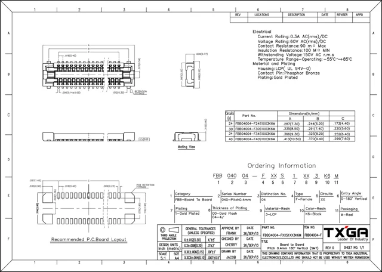
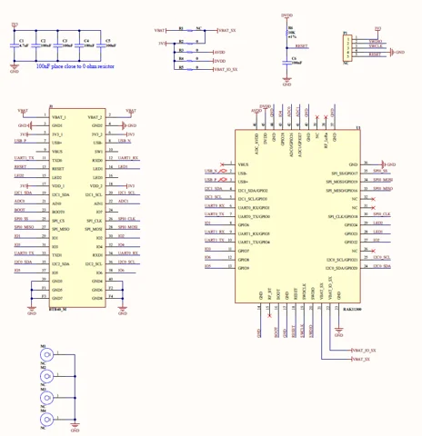

# RAK11310

**RAKwireless** · RP2040

Revision: Not identified

Coverage: Supporting references; complete physical pinout still needed

[Browse all manufacturers](../../../../BROWSE.md) · [Devices & IoT](../../../../DEVICES.md) · [Open in the browser guide](https://valleytech-black-wire-guide.pages.dev/?board=rakwireless-rp2040-rak11310)

## Datasheets and original documentation

Board datasheet: **recorded**. Visual reference: **available**.

[Original manufacturer / project documentation](https://docs.rakwireless.com/product-categories/wisblock/rak11310/datasheet/)

- **datasheet / board**: [RAK11310 manufacturer HTML datasheet](https://docs.rakwireless.com/product-categories/wisblock/rak11310/datasheet/) · online

Source identity and visual scope reviewed. Pin assignments and electrical limits are not independently bench-verified. Match the exact PCB revision, connector view and populated options. Core-module castellations, WisConnector numbers and base-board GPIO labels use different numbering. The core-module table must not be used as a physical base-board map.

[Documentation coverage and remaining gaps](../../../../DOCUMENTATION.md)

## RAK11310 — RAK11310 Overview

**board labeling image** · Source visual inspected; independent electrical and all-pin completeness review pending · SVG

[Open original reference](../../../../library/media/dc75039c2b13e5ae1096f7dee2bffe9bf8b4d28308dd7dd4c85478861d5d9ab4.svg)

**Credit and rights:** RAKwireless / original artwork contributors. Asset-specific redistribution and print rights are not established; Black Wire licenses do not relicense this source artwork.. Source/manufacturer: RAKwireless.

[Source 1](https://images.docs.rakwireless.com/wisblock/rak11310/datasheet/rak11310_overview.svg) · [Source 2](https://docs.rakwireless.com/product-categories/wisblock/rak11310/datasheet/)

Source identity and visual scope reviewed. Pin assignments and electrical limits are not independently bench-verified. Match the exact PCB revision, connector view and populated options. Core-module castellations, WisConnector numbers and base-board GPIO labels use different numbering. The core-module table must not be used as a physical base-board map.

Image revision: Not identified

SHA-256: `dc75039c2b13e5ae1096f7dee2bffe9bf8b4d28308dd7dd4c85478861d5d9ab4`

## RAK11310 — WisConnector PCB footprint and recommendations

**connector reference** · Source visual inspected; independent electrical and all-pin completeness review pending · PNG

[Open original reference](../../../../library/media/03f419b339b65046f158dc8498ec9babef3ff75e04629264241bd7ae2bcee373.png)

**Credit and rights:** RAKwireless / original artwork contributors. Asset-specific redistribution and print rights are not established; Black Wire licenses do not relicense this source artwork.. Source/manufacturer: RAKwireless.

[Source 1](https://images.docs.rakwireless.com/wisblock/rak11310/datasheet/fxxs1003k6m.png) · [Source 2](https://docs.rakwireless.com/product-categories/wisblock/rak11310/datasheet/)

Source identity and visual scope reviewed. Pin assignments and electrical limits are not independently bench-verified. Match the exact PCB revision, connector view and populated options. Core-module castellations, WisConnector numbers and base-board GPIO labels use different numbering. The core-module table must not be used as a physical base-board map.

Image revision: Not identified

SHA-256: `03f419b339b65046f158dc8498ec9babef3ff75e04629264241bd7ae2bcee373`

## RAK11310 — RAK11310 Schematic Diagram

**schematic image** · Source visual inspected; independent electrical and all-pin completeness review pending · PNG

[Open original reference](../../../../library/media/8e83538d798d9ed44cb65c64db0ccfb7ed931d8da902664208e3c9c2d609fe72.png)

**Credit and rights:** RAKwireless / original artwork contributors. Asset-specific redistribution and print rights are not established; Black Wire licenses do not relicense this source artwork.. Source/manufacturer: RAKwireless.

[Source 1](https://images.docs.rakwireless.com/wisblock/rak11310/datasheet/schematic.png) · [Source 2](https://docs.rakwireless.com/product-categories/wisblock/rak11310/datasheet/)

Source identity and visual scope reviewed. Pin assignments and electrical limits are not independently bench-verified. Match the exact PCB revision, connector view and populated options. Core-module castellations, WisConnector numbers and base-board GPIO labels use different numbering. The core-module table must not be used as a physical base-board map.

Image revision: Not identified

SHA-256: `8e83538d798d9ed44cb65c64db0ccfb7ed931d8da902664208e3c9c2d609fe72`

Pin assignments have not been independently electrically verified. Check board revision before wiring.
