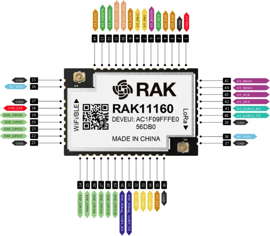

# RAK11160 LoRa Wi-Fi BLE module

**RAKwireless** · STM32WLE5 / ESP32-C2

Revision: PCB revision not established

Coverage: Physical source pinout available; independent completeness review pending

[Browse all manufacturers](../../../../BROWSE.md) · [Devices & IoT](../../../../DEVICES.md) · [Open in the browser guide](https://valleytech-black-wire-guide.pages.dev/?board=rakwireless-rak11160)

## Datasheets and original documentation

Board datasheet: **recorded**. Visual reference: **available**.

[Original manufacturer / project documentation](https://docs.rakwireless.com/product-categories/wisduo/rak11160-module/datasheet/)

- **datasheet / board**: [RAK11160 LoRa Wi-Fi BLE module manufacturer HTML datasheet](https://docs.rakwireless.com/product-categories/wisduo/rak11160-module/datasheet/) · online

Source identity and visual scope reviewed. Pin assignments and electrical limits are not independently bench-verified. Match the exact PCB revision, connector view and populated options. Core-module castellations, WisConnector numbers and base-board GPIO labels use different numbering. The core-module table must not be used as a physical base-board map.

[Documentation coverage and remaining gaps](../../../../DOCUMENTATION.md)

## RAK11160 LoRa Wi-Fi BLE module — RAK11160 module pinout diagram

**pinout image** · Source visual inspected; independent electrical and all-pin completeness review pending · SVG

[Open original reference](../../../../library/media/57e8b97344945256b6d5eb9b1c2ee169b0e84483169902677a172d4a2dc85ec2.svg)

**Credit and rights:** RAKwireless / original artwork contributors. Asset-specific redistribution and print rights are not established; Black Wire licenses do not relicense this source artwork.. Source/manufacturer: RAKwireless.

[Source 1](https://images.docs.rakwireless.com/wisduo/rak11160-module/datasheet/rak11160-pinout.svg) · [Source 2](https://docs.rakwireless.com/product-categories/wisduo/rak11160-module/datasheet/)

Source identity and visual scope reviewed. Pin assignments and electrical limits are not independently bench-verified. Match the exact PCB revision, connector view and populated options. Core-module castellations, WisConnector numbers and base-board GPIO labels use different numbering. The core-module table must not be used as a physical base-board map.

Image revision: PCB revision not established

SHA-256: `57e8b97344945256b6d5eb9b1c2ee169b0e84483169902677a172d4a2dc85ec2`

Pin assignments have not been independently electrically verified. Check board revision before wiring.
