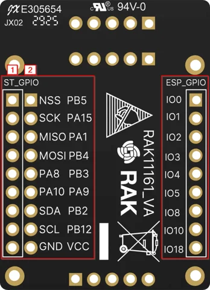
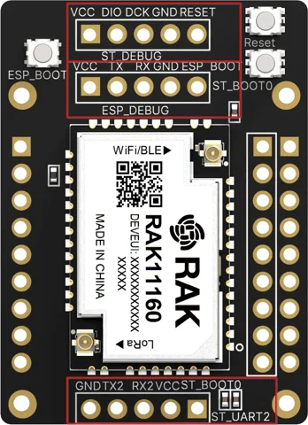

# RAK11161 breakout board

**RAKwireless** · STM32WLE5CC / ESP32-C2

Revision: PCB revision not established

Coverage: Physical source pinout available; independent completeness review pending

[Browse all manufacturers](../../../../BROWSE.md) · [Devices & IoT](../../../../DEVICES.md) · [Open in the browser guide](https://valleytech-black-wire-guide.pages.dev/?board=rakwireless-rak11161)

## Datasheets and original documentation

Board datasheet: **recorded**. Visual reference: **available**.

[Original manufacturer / project documentation](https://docs.rakwireless.com/product-categories/wisduo/rak11161-breakout-board/datasheet/)

- **datasheet / board**: [RAK11161 breakout board manufacturer HTML datasheet](https://docs.rakwireless.com/product-categories/wisduo/rak11161-breakout-board/datasheet/) · online

Source identity and visual scope reviewed. Pin assignments and electrical limits are not independently bench-verified. Match the exact PCB revision, connector view and populated options. Core-module castellations, WisConnector numbers and base-board GPIO labels use different numbering. The core-module table must not be used as a physical base-board map.

[Documentation coverage and remaining gaps](../../../../DOCUMENTATION.md)

## RAK11161 breakout board — RAK11161 module pinout diagram GPIO headers

**pinout image** · Source visual inspected; independent electrical and all-pin completeness review pending · PNG

[Open original reference](../../../../library/media/360400929a65e73b174e79070bf28af28d075b3d0a6c497672dcd19f68f15a5f.png)

**Credit and rights:** RAKwireless / original artwork contributors. Asset-specific redistribution and print rights are not established; Black Wire licenses do not relicense this source artwork.. Source/manufacturer: RAKwireless.

[Source 1](https://images.docs.rakwireless.com/wisduo/rak11161-breakout-board/rak11161-pinout-bottom.png) · [Source 2](https://docs.rakwireless.com/product-categories/wisduo/rak11161-breakout-board/datasheet/)

Source identity and visual scope reviewed. Pin assignments and electrical limits are not independently bench-verified. Match the exact PCB revision, connector view and populated options. Core-module castellations, WisConnector numbers and base-board GPIO labels use different numbering. The core-module table must not be used as a physical base-board map.

Image revision: PCB revision not established

SHA-256: `360400929a65e73b174e79070bf28af28d075b3d0a6c497672dcd19f68f15a5f`

## RAK11161 breakout board — RAK11161 module pinout diagram flashing and debug headers

**pinout image** · Source visual inspected; independent electrical and all-pin completeness review pending · PNG

[Open original reference](../../../../library/media/293d62addbde94c9d1a52eb2c224bf44e5388a594a7b6bad7f5a9adb6d4df5aa.png)

**Credit and rights:** RAKwireless / original artwork contributors. Asset-specific redistribution and print rights are not established; Black Wire licenses do not relicense this source artwork.. Source/manufacturer: RAKwireless.

[Source 1](https://images.docs.rakwireless.com/wisduo/rak11161-breakout-board/rak11161-pinout-top.png) · [Source 2](https://docs.rakwireless.com/product-categories/wisduo/rak11161-breakout-board/datasheet/)

Source identity and visual scope reviewed. Pin assignments and electrical limits are not independently bench-verified. Match the exact PCB revision, connector view and populated options. Core-module castellations, WisConnector numbers and base-board GPIO labels use different numbering. The core-module table must not be used as a physical base-board map.

Image revision: PCB revision not established

SHA-256: `293d62addbde94c9d1a52eb2c224bf44e5388a594a7b6bad7f5a9adb6d4df5aa`

Pin assignments have not been independently electrically verified. Check board revision before wiring.
