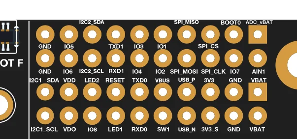
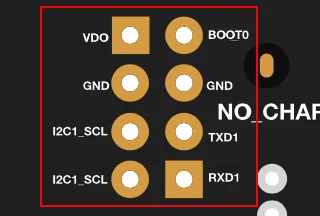
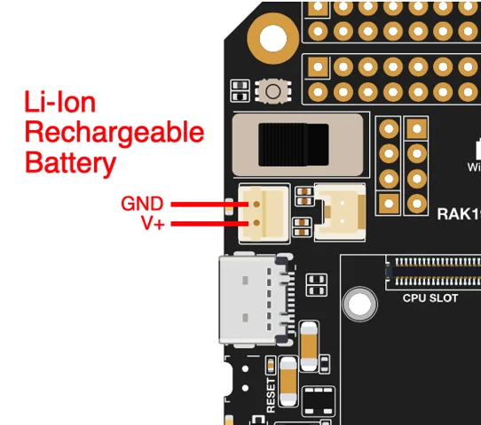
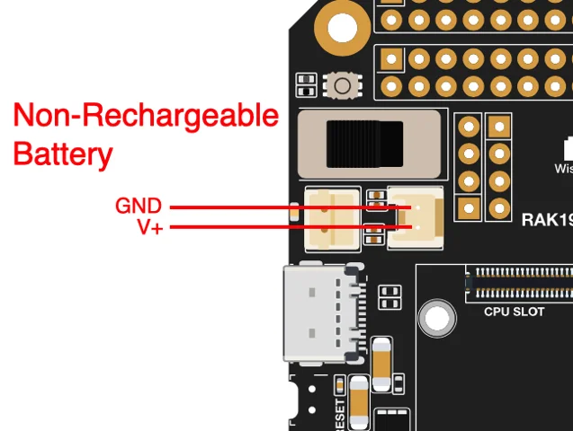
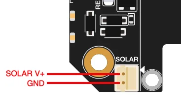
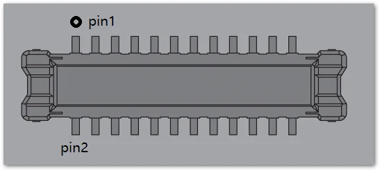

# RAK19001

**RAKwireless** · WisBlock base

Revision: PCB revision not established

Coverage: Physical source pinout available; independent completeness review pending

[Browse all manufacturers](../../../../BROWSE.md) · [Devices & IoT](../../../../DEVICES.md) · [Open in the browser guide](https://valleytech-black-wire-guide.pages.dev/?board=rakwireless-other-rak19001)

## Datasheets and original documentation

Board datasheet: **recorded**. Visual reference: **available**.

[Original manufacturer / project documentation](https://docs.rakwireless.com/product-categories/wisblock/rak19001/datasheet/)

- **datasheet / board**: [RAK19001 manufacturer HTML datasheet](https://docs.rakwireless.com/product-categories/wisblock/rak19001/datasheet/) · online

Source identity and visual scope reviewed. Pin assignments and electrical limits are not independently bench-verified. Match the exact PCB revision, connector view and populated options. Core-module castellations, WisConnector numbers and base-board GPIO labels use different numbering. The core-module table must not be used as a physical base-board map.

[Documentation coverage and remaining gaps](../../../../DOCUMENTATION.md)

## RAK19001 — RAK19001 part labels

**board labeling image** · Source visual inspected; independent electrical and all-pin completeness review pending · PNG

[Open original reference](../../../../library/media/606ccbf1c3e3591862309ae6abaad0bf26f03a3c2c386bc68afb832e567d02c2.png)

**Credit and rights:** RAKwireless / original artwork contributors. Asset-specific redistribution and print rights are not established; Black Wire licenses do not relicense this source artwork.. Source/manufacturer: RAKwireless.

[Source 1](https://images.docs.rakwireless.com/wisblock/rak19001/datasheet/rak19001-label.png) · [Source 2](https://docs.rakwireless.com/product-categories/wisblock/rak19001/datasheet/)

Source identity and visual scope reviewed. Pin assignments and electrical limits are not independently bench-verified. Match the exact PCB revision, connector view and populated options. Core-module castellations, WisConnector numbers and base-board GPIO labels use different numbering. The core-module table must not be used as a physical base-board map.

Image revision: PCB revision not established

SHA-256: `606ccbf1c3e3591862309ae6abaad0bf26f03a3c2c386bc68afb832e567d02c2`

## RAK19001 — J10 and J15 pin header label in bottom side

**pinout image** · Source visual inspected; independent electrical and all-pin completeness review pending · PNG

[Open original reference](../../../../library/media/970cad111a063e3316a9a1732f1afcc3f3f9a42153124169e942fa45b072effd.png)

**Credit and rights:** RAKwireless / original artwork contributors. Asset-specific redistribution and print rights are not established; Black Wire licenses do not relicense this source artwork.. Source/manufacturer: RAKwireless.

[Source 1](https://images.docs.rakwireless.com/wisblock/rak19001/datasheet/j10_j15_label.png) · [Source 2](https://docs.rakwireless.com/product-categories/wisblock/rak19001/datasheet/)

Source identity and visual scope reviewed. Pin assignments and electrical limits are not independently bench-verified. Match the exact PCB revision, connector view and populated options. Core-module castellations, WisConnector numbers and base-board GPIO labels use different numbering. The core-module table must not be used as a physical base-board map.

Image revision: PCB revision not established

SHA-256: `970cad111a063e3316a9a1732f1afcc3f3f9a42153124169e942fa45b072effd`

## RAK19001 — J11 and J12 (I2C and UART) pin header label in bottom side

**pinout image** · Source visual inspected; independent electrical and all-pin completeness review pending · PNG

[Open original reference](../../../../library/media/987c70ff9320e9a121c3cbc2374527356b33169e62b71733b6edb02a8d1d21a7.png)

**Credit and rights:** RAKwireless / original artwork contributors. Asset-specific redistribution and print rights are not established; Black Wire licenses do not relicense this source artwork.. Source/manufacturer: RAKwireless.

[Source 1](https://images.docs.rakwireless.com/wisblock/rak19001/datasheet/j11_j12_label.png) · [Source 2](https://docs.rakwireless.com/product-categories/wisblock/rak19001/datasheet/)

Source identity and visual scope reviewed. Pin assignments and electrical limits are not independently bench-verified. Match the exact PCB revision, connector view and populated options. Core-module castellations, WisConnector numbers and base-board GPIO labels use different numbering. The core-module table must not be used as a physical base-board map.

Image revision: PCB revision not established

SHA-256: `987c70ff9320e9a121c3cbc2374527356b33169e62b71733b6edb02a8d1d21a7`

## RAK19001 — Rechargeable battery connector pin label V+ and GND

**pinout image** · Source visual inspected; independent electrical and all-pin completeness review pending · PNG

[Open original reference](../../../../library/media/a80c485b07912cf14398cf27bbba1fcf332c2520f64362abfaf21b6f34fa9902.png)

**Credit and rights:** RAKwireless / original artwork contributors. Asset-specific redistribution and print rights are not established; Black Wire licenses do not relicense this source artwork.. Source/manufacturer: RAKwireless.

[Source 1](https://images.docs.rakwireless.com/wisblock/rak19001/datasheet/rechargeable.png) · [Source 2](https://docs.rakwireless.com/product-categories/wisblock/rak19001/datasheet/)

Source identity and visual scope reviewed. Pin assignments and electrical limits are not independently bench-verified. Match the exact PCB revision, connector view and populated options. Core-module castellations, WisConnector numbers and base-board GPIO labels use different numbering. The core-module table must not be used as a physical base-board map.

Image revision: PCB revision not established

SHA-256: `a80c485b07912cf14398cf27bbba1fcf332c2520f64362abfaf21b6f34fa9902`

## RAK19001 — Non-Rechargeable battery connector pin label V+ and GND

**pinout image** · Source visual inspected; independent electrical and all-pin completeness review pending · PNG

[Open original reference](../../../../library/media/a4142d9c5a71f8f9d72d3145cd695ef1ee73551a5a85d40d57c2f51686b9a7d1.png)

**Credit and rights:** RAKwireless / original artwork contributors. Asset-specific redistribution and print rights are not established; Black Wire licenses do not relicense this source artwork.. Source/manufacturer: RAKwireless.

[Source 1](https://images.docs.rakwireless.com/wisblock/rak19001/datasheet/non-rechargeable.png) · [Source 2](https://docs.rakwireless.com/product-categories/wisblock/rak19001/datasheet/)

Source identity and visual scope reviewed. Pin assignments and electrical limits are not independently bench-verified. Match the exact PCB revision, connector view and populated options. Core-module castellations, WisConnector numbers and base-board GPIO labels use different numbering. The core-module table must not be used as a physical base-board map.

Image revision: PCB revision not established

SHA-256: `a4142d9c5a71f8f9d72d3145cd695ef1ee73551a5a85d40d57c2f51686b9a7d1`

## RAK19001 — Solar panel connector V+ and GND

**pinout image** · Source visual inspected; independent electrical and all-pin completeness review pending · PNG

[Open original reference](../../../../library/media/16a65644848ec2d981bcd4232126eae3b3b6f3097c160c713539f959d8144300.png)

**Credit and rights:** RAKwireless / original artwork contributors. Asset-specific redistribution and print rights are not established; Black Wire licenses do not relicense this source artwork.. Source/manufacturer: RAKwireless.

[Source 1](https://images.docs.rakwireless.com/wisblock/rak19001/datasheet/solar_label.png) · [Source 2](https://docs.rakwireless.com/product-categories/wisblock/rak19001/datasheet/)

Source identity and visual scope reviewed. Pin assignments and electrical limits are not independently bench-verified. Match the exact PCB revision, connector view and populated options. Core-module castellations, WisConnector numbers and base-board GPIO labels use different numbering. The core-module table must not be used as a physical base-board map.

Image revision: PCB revision not established

SHA-256: `16a65644848ec2d981bcd4232126eae3b3b6f3097c160c713539f959d8144300`

## RAK19001 — WisBlock Core module 40-pin connector

**connector reference** · Source visual inspected; independent electrical and all-pin completeness review pending · PNG

[Open original reference](../../../../library/media/644ca7314775368b247f6638e4ed48dd1cad6dce75b48591e8b37101312849be.png)

**Credit and rights:** RAKwireless / original artwork contributors. Asset-specific redistribution and print rights are not established; Black Wire licenses do not relicense this source artwork.. Source/manufacturer: RAKwireless.

[Source 1](https://images.docs.rakwireless.com/wisblock/rak19001/datasheet/12.mcu-module-connector.png) · [Source 2](https://docs.rakwireless.com/product-categories/wisblock/rak19001/datasheet/)

Source identity and visual scope reviewed. Pin assignments and electrical limits are not independently bench-verified. Match the exact PCB revision, connector view and populated options. Core-module castellations, WisConnector numbers and base-board GPIO labels use different numbering. The core-module table must not be used as a physical base-board map.

Image revision: PCB revision not established

SHA-256: `644ca7314775368b247f6638e4ed48dd1cad6dce75b48591e8b37101312849be`

## RAK19001 — WisBlock 24-pin module connector

**connector reference** · Source visual inspected; independent electrical and all-pin completeness review pending · PNG

[Open original reference](../../../../library/media/7068d271ee9603c4750b286fea4caef63dc7730e6a589fccf191c08bf7ccf9c5.png)

**Credit and rights:** RAKwireless / original artwork contributors. Asset-specific redistribution and print rights are not established; Black Wire licenses do not relicense this source artwork.. Source/manufacturer: RAKwireless.

[Source 1](https://images.docs.rakwireless.com/wisblock/rak19001/datasheet/13.wissensor-module-connector.png) · [Source 2](https://docs.rakwireless.com/product-categories/wisblock/rak19001/datasheet/)

Source identity and visual scope reviewed. Pin assignments and electrical limits are not independently bench-verified. Match the exact PCB revision, connector view and populated options. Core-module castellations, WisConnector numbers and base-board GPIO labels use different numbering. The core-module table must not be used as a physical base-board map.

Image revision: PCB revision not established

SHA-256: `7068d271ee9603c4750b286fea4caef63dc7730e6a589fccf191c08bf7ccf9c5`

Pin assignments have not been independently electrically verified. Check board revision before wiring.
