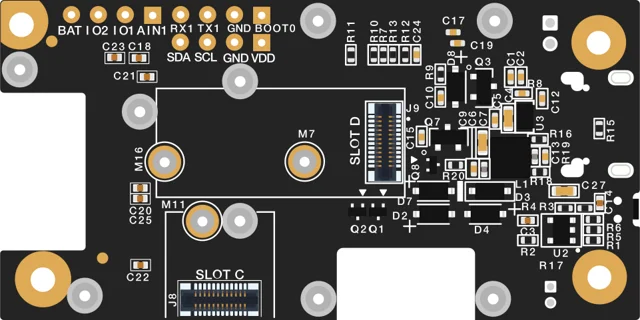
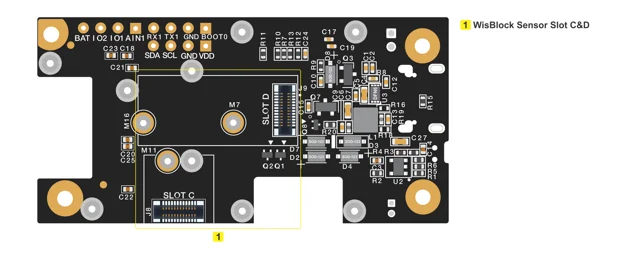

# RAK19007

**RAKwireless** · WisBlock base

Revision: PCB revision not established

Coverage: Supporting references; complete physical pinout still needed

[Browse all manufacturers](../../../../BROWSE.md) · [Devices & IoT](../../../../DEVICES.md) · [Open in the browser guide](https://valleytech-black-wire-guide.pages.dev/?board=rakwireless-other-rak19007)

## Datasheets and original documentation

Board datasheet: **recorded**. Visual reference: **available**.

[Original manufacturer / project documentation](https://docs.rakwireless.com/product-categories/wisblock/rak19007/datasheet/)

- **datasheet / board**: [RAK19007 manufacturer HTML datasheet](https://docs.rakwireless.com/product-categories/wisblock/rak19007/datasheet/) · online

Source identity and visual scope reviewed. Pin assignments and electrical limits are not independently bench-verified. Match the exact PCB revision, connector view and populated options. Core-module castellations, WisConnector numbers and base-board GPIO labels use different numbering. The core-module table must not be used as a physical base-board map.

[Documentation coverage and remaining gaps](../../../../DOCUMENTATION.md)

## RAK19007 — WisBlock Base Board 2nd Gen bottom view

**board labeling image** · Source visual inspected; independent electrical and all-pin completeness review pending · SVG

[Open original reference](../../../../library/media/d19d69b443f7c9fc48f855a3b32f1b1495b7cbcc96f303f394354bd30d069d80.svg)

**Credit and rights:** RAKwireless / original artwork contributors. Asset-specific redistribution and print rights are not established; Black Wire licenses do not relicense this source artwork.. Source/manufacturer: RAKwireless.

[Source 1](https://images.docs.rakwireless.com/wisblock/rak19007/datasheet/rak19007-bottom.svg) · [Source 2](https://docs.rakwireless.com/product-categories/wisblock/rak19007/datasheet/)

Source identity and visual scope reviewed. Pin assignments and electrical limits are not independently bench-verified. Match the exact PCB revision, connector view and populated options. Core-module castellations, WisConnector numbers and base-board GPIO labels use different numbering. The core-module table must not be used as a physical base-board map.

Image revision: PCB revision not established

SHA-256: `d19d69b443f7c9fc48f855a3b32f1b1495b7cbcc96f303f394354bd30d069d80`

## RAK19007 — RAK19007 bottom view components

**board labeling image** · Source visual inspected; independent electrical and all-pin completeness review pending · PNG

[Open original reference](../../../../library/media/dbc8d11ed2c230d1cc5fcd682a4d29f18af95392e8d18baf82776a310bab544c.png)

**Credit and rights:** RAKwireless / original artwork contributors. Asset-specific redistribution and print rights are not established; Black Wire licenses do not relicense this source artwork.. Source/manufacturer: RAKwireless.

[Source 1](https://images.docs.rakwireless.com/wisblock/rak19007/datasheet/rak19007-bot-interface.png) · [Source 2](https://docs.rakwireless.com/product-categories/wisblock/rak19007/datasheet/)

Source identity and visual scope reviewed. Pin assignments and electrical limits are not independently bench-verified. Match the exact PCB revision, connector view and populated options. Core-module castellations, WisConnector numbers and base-board GPIO labels use different numbering. The core-module table must not be used as a physical base-board map.

Image revision: PCB revision not established

SHA-256: `dbc8d11ed2c230d1cc5fcd682a4d29f18af95392e8d18baf82776a310bab544c`

Pin assignments have not been independently electrically verified. Check board revision before wiring.
