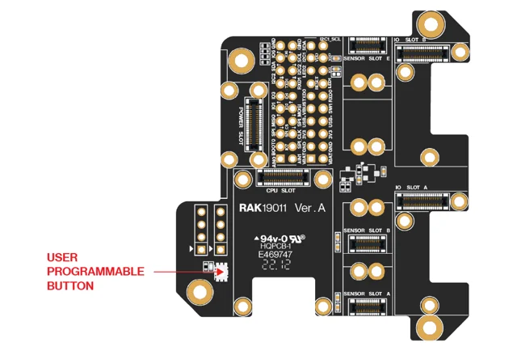
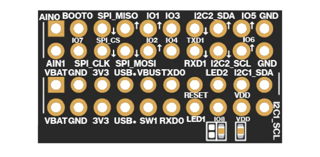
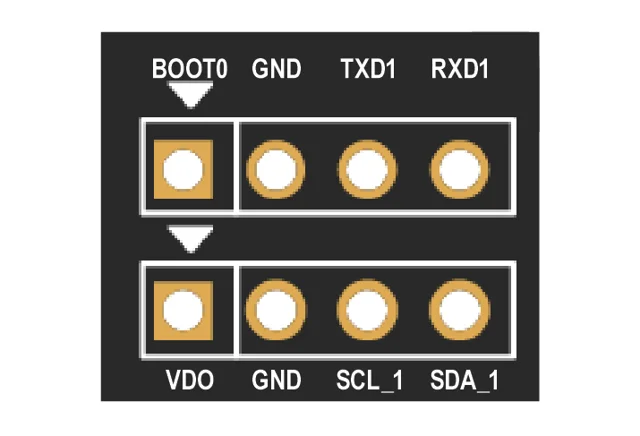
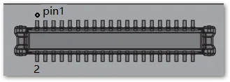

# RAK19011 Dual IO Base

**RAKwireless** · WisBlock base

Revision: PCB revision not established

Coverage: Physical source pinout available; independent completeness review pending

[Browse all manufacturers](../../../../BROWSE.md) · [Devices & IoT](../../../../DEVICES.md) · [Open in the browser guide](https://valleytech-black-wire-guide.pages.dev/?board=rakwireless-rak19011)

## Datasheets and original documentation

Board datasheet: **recorded**. Visual reference: **available**.

[Original manufacturer / project documentation](https://docs.rakwireless.com/product-categories/wisblock/rak19011/datasheet/)

- **datasheet / board**: [RAK19011 Dual IO Base manufacturer HTML datasheet](https://docs.rakwireless.com/product-categories/wisblock/rak19011/datasheet/) · online

Source identity and visual scope reviewed. Pin assignments and electrical limits are not independently bench-verified. Match the exact PCB revision, connector view and populated options. Core-module castellations, WisConnector numbers and base-board GPIO labels use different numbering. The core-module table must not be used as a physical base-board map.

[Documentation coverage and remaining gaps](../../../../DOCUMENTATION.md)

## RAK19011 Dual IO Base — RAK19011 part label

**board labeling image** · Source visual inspected; independent electrical and all-pin completeness review pending · PNG

[Open original reference](../../../../library/media/63b91379ca0463ad13b66d9c315e5163677431a4da785f97ae443c99b43d4a3f.png)

**Credit and rights:** RAKwireless / original artwork contributors. Asset-specific redistribution and print rights are not established; Black Wire licenses do not relicense this source artwork.. Source/manufacturer: RAKwireless.

[Source 1](https://images.docs.rakwireless.com/wisblock/rak19011/datasheet/rak19011-interface.png) · [Source 2](https://docs.rakwireless.com/product-categories/wisblock/rak19011/datasheet/)

Source identity and visual scope reviewed. Pin assignments and electrical limits are not independently bench-verified. Match the exact PCB revision, connector view and populated options. Core-module castellations, WisConnector numbers and base-board GPIO labels use different numbering. The core-module table must not be used as a physical base-board map.

Image revision: PCB revision not established

SHA-256: `63b91379ca0463ad13b66d9c315e5163677431a4da785f97ae443c99b43d4a3f`

## RAK19011 Dual IO Base — J19 and J20 pin header label in top side

**pinout image** · Source visual inspected; independent electrical and all-pin completeness review pending · PNG

[Open original reference](../../../../library/media/e9afad901cf61590a53c23c2f61e0999aa557c0c575cd6d3e5e0a0b8632a5d00.png)

**Credit and rights:** RAKwireless / original artwork contributors. Asset-specific redistribution and print rights are not established; Black Wire licenses do not relicense this source artwork.. Source/manufacturer: RAKwireless.

[Source 1](https://images.docs.rakwireless.com/wisblock/rak19011/datasheet/j19-j20_label.png) · [Source 2](https://docs.rakwireless.com/product-categories/wisblock/rak19011/datasheet/)

Source identity and visual scope reviewed. Pin assignments and electrical limits are not independently bench-verified. Match the exact PCB revision, connector view and populated options. Core-module castellations, WisConnector numbers and base-board GPIO labels use different numbering. The core-module table must not be used as a physical base-board map.

Image revision: PCB revision not established

SHA-256: `e9afad901cf61590a53c23c2f61e0999aa557c0c575cd6d3e5e0a0b8632a5d00`

## RAK19011 Dual IO Base — J21 and J18 (I2C and UART) pin header label in bottom side

**pinout image** · Source visual inspected; independent electrical and all-pin completeness review pending · PNG

[Open original reference](../../../../library/media/929a1d4b2cab3e967f7a3ca3a308c8a0421a1e06c8d2f86dd89a9ea55c44c06c.png)

**Credit and rights:** RAKwireless / original artwork contributors. Asset-specific redistribution and print rights are not established; Black Wire licenses do not relicense this source artwork.. Source/manufacturer: RAKwireless.

[Source 1](https://images.docs.rakwireless.com/wisblock/rak19011/datasheet/j18-j21_label.png) · [Source 2](https://docs.rakwireless.com/product-categories/wisblock/rak19011/datasheet/)

Source identity and visual scope reviewed. Pin assignments and electrical limits are not independently bench-verified. Match the exact PCB revision, connector view and populated options. Core-module castellations, WisConnector numbers and base-board GPIO labels use different numbering. The core-module table must not be used as a physical base-board map.

Image revision: PCB revision not established

SHA-256: `929a1d4b2cab3e967f7a3ca3a308c8a0421a1e06c8d2f86dd89a9ea55c44c06c`

## RAK19011 Dual IO Base —  WisBlock Core module 40-pin connector

**connector reference** · Source visual inspected; independent electrical and all-pin completeness review pending · PNG

[Open original reference](../../../../library/media/644ca7314775368b247f6638e4ed48dd1cad6dce75b48591e8b37101312849be.png)

**Credit and rights:** RAKwireless / original artwork contributors. Asset-specific redistribution and print rights are not established; Black Wire licenses do not relicense this source artwork.. Source/manufacturer: RAKwireless.

[Source 1](https://images.docs.rakwireless.com/wisblock/rak19011/datasheet/12.mcu-module-connector.png) · [Source 2](https://docs.rakwireless.com/product-categories/wisblock/rak19011/datasheet/)

Connector-position illustration only; no complete physical GPIO mapping is asserted.

Image revision: PCB revision not established

SHA-256: `644ca7314775368b247f6638e4ed48dd1cad6dce75b48591e8b37101312849be`

Pin assignments have not been independently electrically verified. Check board revision before wiring.
