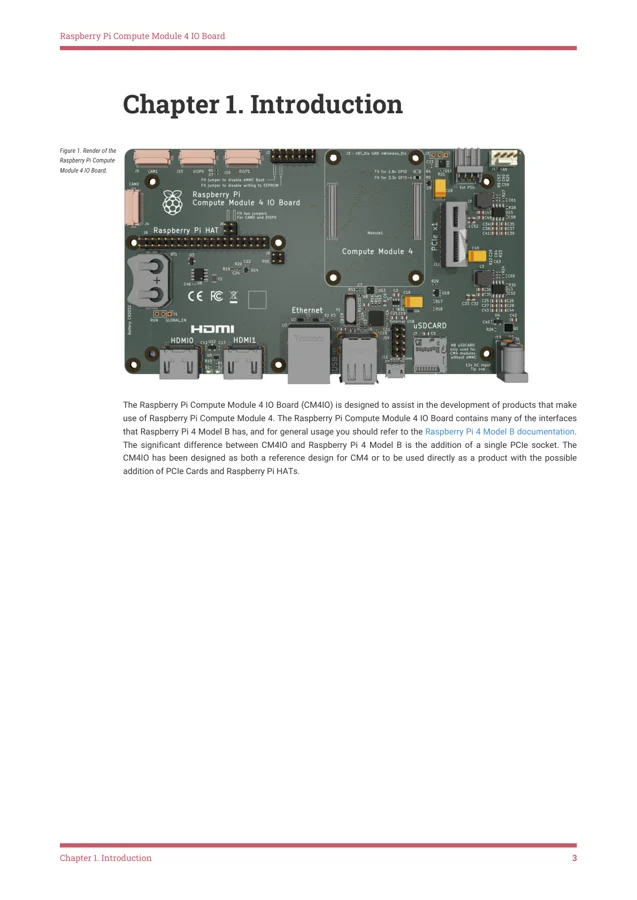
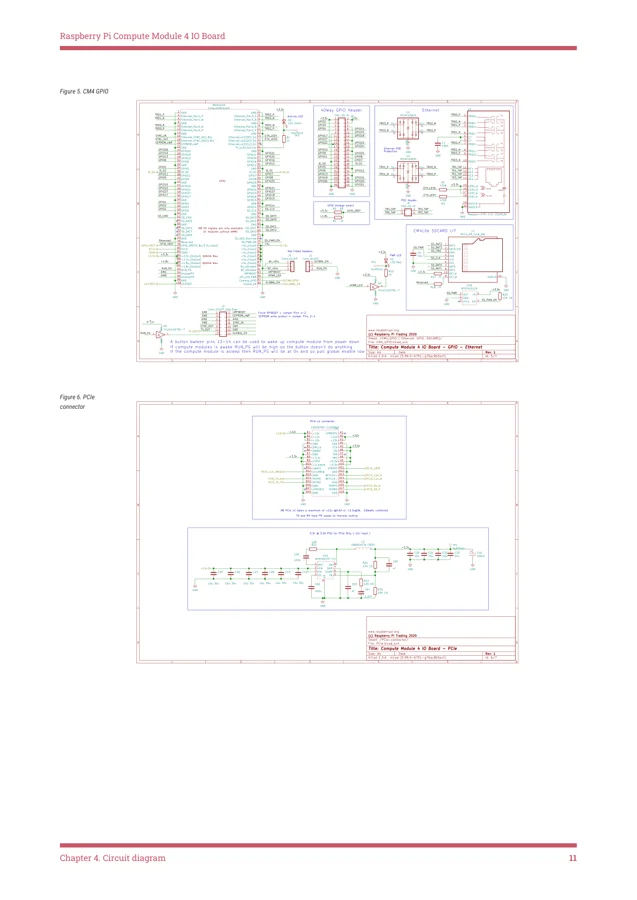

# Compute Module 4 IO Board

**Raspberry Pi** · Expansion

Revision: See exact source revision

Coverage: Supporting references collected; physical GPIO map still needed

[Browse all manufacturers](../../../../BROWSE.md) · [Devices & IoT](../../../../DEVICES.md) · [Open in the browser guide](https://valleytech-black-wire-guide.pages.dev/?board=raspberry-pi-raspberry-pi-sbc-compute-module-4-io-board)

Architecture: **ARM**

## Datasheets and original documentation

Board datasheet: **recorded**. Visual reference: **available**.

[Original manufacturer hardware website](https://pip.raspberrypi.com/categories/756-raspberry-pi-compute-module-4-io-board)

- **datasheet / board**: [Compute Module 4 IO Board datasheet](https://pip-assets.raspberrypi.com/categories/756-raspberry-pi-compute-module-4-io-board/documents/RP-008172-DS-1-cm4io-datasheet.pdf) · [saved document](../../../../library/media/5e89840aba4011f416513ba59f6ca671dae3b342b9e07641bcfe215177f03969.pdf)

Match the exact board, carrier and PCB revision. A component datasheet does not define the board header or input-power limits.

[Documentation coverage and remaining gaps](../../../../DOCUMENTATION.md)

## Specifications and hardware documentation

- [Manufacturer specifications & hardware guide](https://pip.raspberrypi.com/categories/756-raspberry-pi-compute-module-4-io-board)

## Compute Module 4 IO Board datasheet

**original reference PDF** · Reviewed source · PDF

[Open original reference](../../../../library/media/5e89840aba4011f416513ba59f6ca671dae3b342b9e07641bcfe215177f03969.pdf)

**Credit and rights:** Raspberry Pi / original reference contributors. Asset-specific redistribution and print rights have not been established. Original artwork is not relicensed by the Black Wire editorial license.. Source/manufacturer: Raspberry Pi.

[Source 1](https://pip-assets.raspberrypi.com/categories/756-raspberry-pi-compute-module-4-io-board/documents/RP-008172-DS-1-cm4io-datasheet.pdf) · [Source 2](https://pip.raspberrypi.com/categories/756-raspberry-pi-compute-module-4-io-board) · [Source 3](https://www.raspberrypi.com/products/compute-module-4-io-board/) · [Source 4](https://www.adafruit.com/product/4787) · [Source 5](https://circuitpython.org/board/raspberrypi_cm4io/)

Only the connectors and PCB revision shown are covered. Match physical orientation and electrical limits in the manufacturer hardware guide.

Image revision: See exact source revision

SHA-256: `5e89840aba4011f416513ba59f6ca671dae3b342b9e07641bcfe215177f03969`

## Compute Module 4 IO Board — datasheet page 4

**board labeling image** · Reviewed source · PNG

[Open original reference](../../../../library/media/64c1da1b5a9d1e09710ab322acb4f0bbb30833d2a64353bd324da9db68154fc5.png)

**Credit and rights:** Raspberry Pi / original reference contributors. Asset-specific redistribution and print rights have not been established. Original artwork is not relicensed by the Black Wire editorial license.. Source/manufacturer: Raspberry Pi.

[Source 1](https://pip-assets.raspberrypi.com/categories/756-raspberry-pi-compute-module-4-io-board/documents/RP-008172-DS-1-cm4io-datasheet.pdf) · [Source 2](https://pip.raspberrypi.com/categories/756-raspberry-pi-compute-module-4-io-board) · [Source 3](https://www.raspberrypi.com/products/compute-module-4-io-board/) · [Source 4](https://www.adafruit.com/product/4787) · [Source 5](https://circuitpython.org/board/raspberrypi_cm4io/)

Only the connectors and PCB revision shown are covered. Match physical orientation and electrical limits in the manufacturer hardware guide. Original PDF page rendered at 144 dpi; original PDF retained unchanged.

Image revision: See exact source revision

SHA-256: `64c1da1b5a9d1e09710ab322acb4f0bbb30833d2a64353bd324da9db68154fc5`

## Compute Module 4 IO Board — datasheet page 12

**pin function reference** · Reviewed source · PNG

[Open original reference](../../../../library/media/0d2ef7a7e0f47c55086b215f5e05154a6a6b2d7710507f4777234dd71d06fa61.png)

**Credit and rights:** Raspberry Pi / original reference contributors. Asset-specific redistribution and print rights have not been established. Original artwork is not relicensed by the Black Wire editorial license.. Source/manufacturer: Raspberry Pi.

[Source 1](https://pip-assets.raspberrypi.com/categories/756-raspberry-pi-compute-module-4-io-board/documents/RP-008172-DS-1-cm4io-datasheet.pdf) · [Source 2](https://pip.raspberrypi.com/categories/756-raspberry-pi-compute-module-4-io-board) · [Source 3](https://www.raspberrypi.com/products/compute-module-4-io-board/) · [Source 4](https://www.adafruit.com/product/4787) · [Source 5](https://circuitpython.org/board/raspberrypi_cm4io/)

Only the connectors and PCB revision shown are covered. Match physical orientation and electrical limits in the manufacturer hardware guide. Original PDF page rendered at 144 dpi; original PDF retained unchanged.

Image revision: See exact source revision

SHA-256: `0d2ef7a7e0f47c55086b215f5e05154a6a6b2d7710507f4777234dd71d06fa61`

Pin assignments have not been independently electrically verified. Check board revision before wiring.
