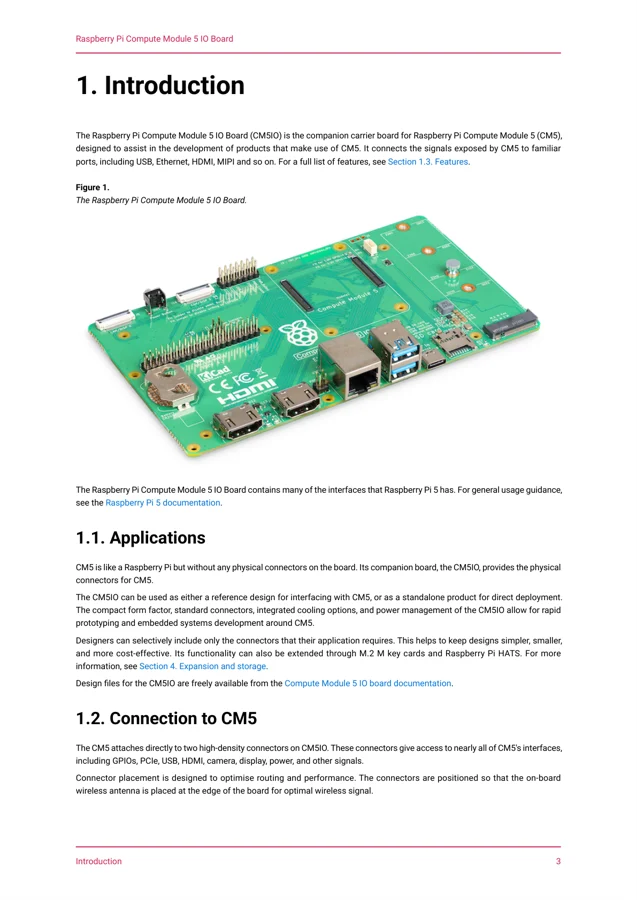
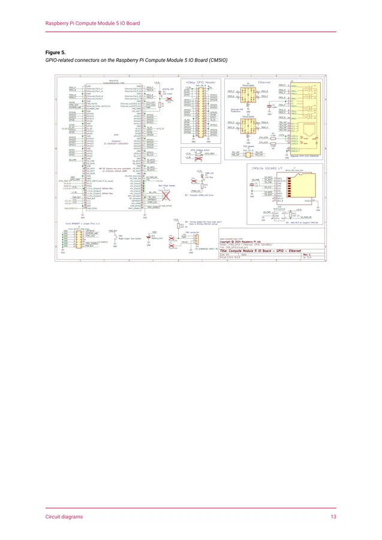

# Compute Module 5 IO Board

**Raspberry Pi** · Expansion

Revision: See exact source revision

Coverage: Supporting references collected; physical GPIO map still needed

[Browse all manufacturers](../../../../BROWSE.md) · [Devices & IoT](../../../../DEVICES.md) · [Open in the browser guide](https://valleytech-black-wire-guide.pages.dev/?board=raspberry-pi-compute-module-5-io-board)

## Datasheets and original documentation

Board datasheet: **recorded**. Visual reference: **available**.

[Original manufacturer hardware website](https://pip.raspberrypi.com/categories/1097-raspberry-pi-compute-module-5-io-board)

- **datasheet / board**: [Compute Module 5 IO Board datasheet](https://pip-assets.raspberrypi.com/categories/1097-raspberry-pi-compute-module-5-io-board/documents/RP-008182-DS-3-cm5io-datasheet.pdf) · [saved document](../../../../library/media/4fd7f9edea384ccec4710943a886c5cd922dcdcd3b17f519325d3c70933f8f8e.pdf)

Match the exact board, carrier and PCB revision. A component datasheet does not define the board header or input-power limits.

[Documentation coverage and remaining gaps](../../../../DOCUMENTATION.md)

## Specifications and hardware documentation

- [Manufacturer specifications & hardware guide](https://pip.raspberrypi.com/categories/1097-raspberry-pi-compute-module-5-io-board)

## Compute Module 5 IO Board datasheet

**original reference PDF** · Reviewed source · PDF

[Open original reference](../../../../library/media/4fd7f9edea384ccec4710943a886c5cd922dcdcd3b17f519325d3c70933f8f8e.pdf)

**Credit and rights:** Raspberry Pi / original reference contributors. Asset-specific redistribution and print rights have not been established. Original artwork is not relicensed by the Black Wire editorial license.. Source/manufacturer: Raspberry Pi.

[Source 1](https://pip-assets.raspberrypi.com/categories/1097-raspberry-pi-compute-module-5-io-board/documents/RP-008182-DS-3-cm5io-datasheet.pdf) · [Source 2](https://pip.raspberrypi.com/categories/1097-raspberry-pi-compute-module-5-io-board)

Only the connectors and PCB revision shown are covered. Match physical orientation and electrical limits in the manufacturer hardware guide.

Image revision: See exact source revision

SHA-256: `4fd7f9edea384ccec4710943a886c5cd922dcdcd3b17f519325d3c70933f8f8e`

## Compute Module 5 IO Board — datasheet page 4

**product photograph** · Reviewed source · PNG

[Open original reference](../../../../library/media/8345925a81638dd07073df8259367c1a9e51c3490abc96879061981123984002.png)

**Credit and rights:** Raspberry Pi / original reference contributors. Asset-specific redistribution and print rights have not been established. Original artwork is not relicensed by the Black Wire editorial license.. Source/manufacturer: Raspberry Pi.

[Source 1](https://pip-assets.raspberrypi.com/categories/1097-raspberry-pi-compute-module-5-io-board/documents/RP-008182-DS-3-cm5io-datasheet.pdf) · [Source 2](https://pip.raspberrypi.com/categories/1097-raspberry-pi-compute-module-5-io-board)

Original datasheet page with board photograph and introduction; this is not a GPIO pinout. Original PDF retained.

Image revision: See exact source revision

SHA-256: `8345925a81638dd07073df8259367c1a9e51c3490abc96879061981123984002`

## Compute Module 5 IO Board — datasheet page 14

**pin function reference** · Reviewed source · PNG

[Open original reference](../../../../library/media/4bb96c4c7bb2ed6229eb3469f7f15b891b32e6381039f3fc9cce3a1108d16243.png)

**Credit and rights:** Raspberry Pi / original reference contributors. Asset-specific redistribution and print rights have not been established. Original artwork is not relicensed by the Black Wire editorial license.. Source/manufacturer: Raspberry Pi.

[Source 1](https://pip-assets.raspberrypi.com/categories/1097-raspberry-pi-compute-module-5-io-board/documents/RP-008182-DS-3-cm5io-datasheet.pdf) · [Source 2](https://pip.raspberrypi.com/categories/1097-raspberry-pi-compute-module-5-io-board)

Only the connectors and PCB revision shown are covered. Match physical orientation and electrical limits in the manufacturer hardware guide. Original PDF page rendered at 144 dpi; original PDF retained unchanged.

Image revision: See exact source revision

SHA-256: `4bb96c4c7bb2ed6229eb3469f7f15b891b32e6381039f3fc9cce3a1108d16243`

Pin assignments have not been independently electrically verified. Check board revision before wiring.
